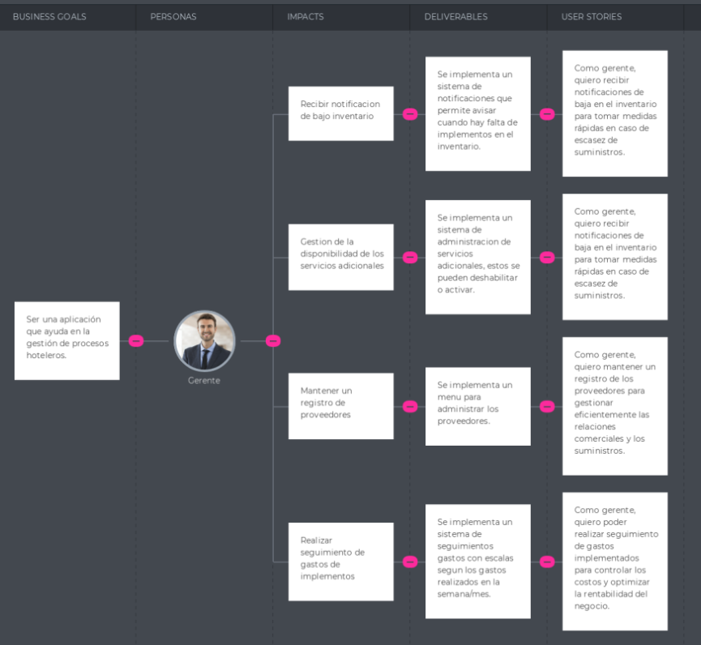
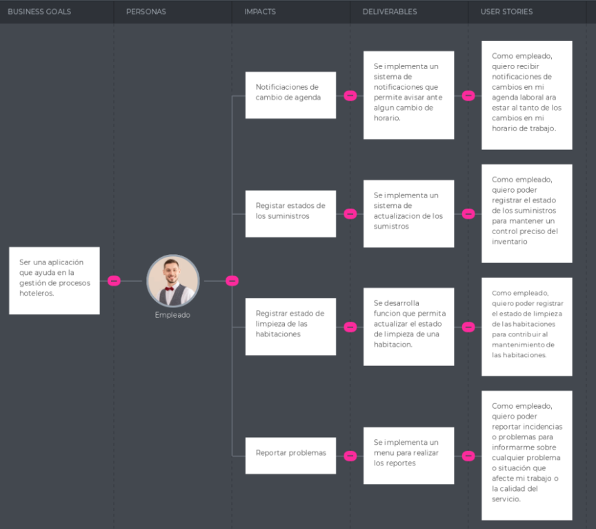

# Universidad Peruana De Ciencas Aplicadas
## 1ASI0572 Desarrollo de Soluciones IOT
### INGENIERÍA DE SOFTWARE

 </img> 

# Informe Trabajo Final
## Docente: Marco Antonio Leon Baca
## Startup: SuiteTechTeam
## Producto: 
## Integrantes 

 
 

* **Aaron Elias Acuña Alarcon U202211552**
* **Diego Rafael Cisneros Tafur U20221a715**
* **Ely Rivaldo Cortez Flores U202215313**
* **Francis Daniel Mamani Silva U202219315** 
* **Mariana Alexandra Chambi Mendoza U202217389**

### Abril 2025
### Ciclo: 2025-01
### NRC: 15185

---

 

## Registro de Versiones del Informe

| Versión | Fecha      | Autor      | Descripción de modificación                                                                                         |
| ------- | ---------- | ---------- | ------------------------------------------------------------------------------------------------------------------- |
| 1.0     | 14/04/2025 | Ely Cortez | Se creo la ramificación del repositorio y se adicionó los documentos en su versión inicial previa a la investigacón |

### Project Report Collaboration Insights

URL del repositorio para el reporte del proyecto: https://github.com/SuiteTechTeam/Project-report

Github Collaboration Insights proporciona un cronograma que muestra las principales ramas y los procesos de fusión que han ocurrido. Todas las ramas se han generado siguiendo los principios de GitFlow, lo que garantiza una organización efectiva al utilizar un sistema de control de versiones.

- Aaron Elias Acuña Alarcon (JenayAaron)
- Diego Rafael Cisneros Tafur (Diego22rct)
- Ely Rivaldo Cortez Flores (rivacortez)
- Francis Daniel Mamani Silva (usuarioGithub)
- Mariana Alexandra Chambi Mendoza (MarianaAlexandra05)

Se divieron las siguientes ramas para la colaboración en el proyecto:

- main
- quality
- develop

* #### Entregable TB1

A continuación se presentan los gráficos de colaboración de los integrantes del equipo en el repositorio de nuestro 
primer sprint. Estos gráficos ofrecen una representación visual de la cantidad de contribuciones realizadas por cada
miembro del equipo, junto con la fecha en que se llevaron a cabo. Además, se presenta información sobre la cantidad de 
líneas de código que se han modificado en cada uno de los commits.

## Contenido 

1. [Capítulo I: Introducción](docs/chapter-I.md#capítulo-i-introducción)
   
    1.1. [Startup Profile](docs/chapter-I.md#11-startup-profile)
   
    1.1.1. [Descripción de la Startup](docs/chapter-I.md#111-descripción-de-la-startup)
   
    1.1.2. [Perfiles de integrantes del equipo](docs/chapter-I.md#112-perfiles-de-integrantes-del-equipo)
   
    1.2. [Solution Profile](docs/chapter-I.md#12-solution-profile)
   
    1.2.1. [Antecedentes y problemática](docs/chapter-I.md#121-antecedentes-y-problemática)
   
    1.2.2. [Lean UX Process](docs/chapter-I.md#122-lean-ux-process)
   
    1.2.2.1. [Lean UX Problem Statements](docs/chapter-I.md#1221-lean-ux-problem-statements)
   
    1.2.2.2. [Lean UX Assumptions](docs/chapter-I.md#1222-lean-ux-assumptions)
   
    1.2.2.3. [Lean UX Hypothesis Statements](docs/chapter-I.md#1223-lean-ux-hypothesis-statements)
   
    1.2.2.4. [Lean UX Canvas](docs/chapter-I.md#1224-lean-ux-canvas)
   
    1.3. [Segmentos objetivo](docs/chapter-I.md#13-segmentos-objetivo)

3. [Capítulo II: Requirements Elicitation & Analysis](docs/chapter-II.md#capítulo-ii-requirements-elicitation--analysis)
   
    2.1. [Competidores](docs/chapter-II.md#21-competidores)

    2.1.1. [Análisis competitivo](docs/chapter-II.md#211-análisis-competitivo)
   
    2.1.2. [Estrategias y tácticas frente a competidores](docs/chapter-II.md#212-estrategias-y-tácticas-frente-a-competidores)
   
    2.2. [Entrevistas](docs/chapter-II.md#22-entrevistas)
   
    2.2.1. [Diseño de entrevistas](docs/chapter-II.md#221-diseño-de-entrevistas)
   
    2.2.2. [Registro de entrevistas](docs/chapter-II.md#222-registro-de-entrevistas)
   
    2.2.3. [Análisis de entrevistas](docs/chapter-II.md#223-análisis-de-entrevistas)
   
    2.3. [Needfinding](docs/chapter-II.md#23-needfinding)
   
    2.3.1. [User Personas](docs/chapter-II.md#231-user-personas)
   
    2.3.2. [User Task Matrix](docs/chapter-II.md#232-user-task-matrix)
   
    2.3.3. [User Journey Mapping](docs/chapter-II.md#233-user-journey-mapping)
   
    2.3.4. [Empathy Mapping](docs/chapter-II.md#234-empathy-mapping)
   
    2.3.5. [As-is Scenario Mapping](docs/chapter-II.md#235-as-is-scenario-mapping)
   
    2.4. [Ubiquitous Language](docs/chapter-II.md#24-ubiquitous-language)

5. [Capítulo III: Requirements Specification](docs/chapter-III.md#capítulo-iii-requirements-specification)
   
    3.1. [To-Be Scenario Mapping](docs/chapter-III.md#31-to-be-scenario-mapping)
   
    3.2. [User Stories](docs/chapter-III.md#32-user-stories)
   
    3.3. [Impact Mapping](docs/chapter-III.md#33-impact-mapping)
   
    3.4. [Product Backlog](docs/chapter-III.md#34-product-backlog)

7. [Capítulo IV: Solution Software Design](docs/chapter-IV.md#capítulo-iv-solution-software-design)
   
    4.1. [Strategic-Level Domain-Driven Design](docs/chapter-IV.md#41-strategic-level-domain-driven-design)
   
   4.1.1. [EventStorming](docs/chapter-IV.md#411-eventstorming)
   
   4.1.1.1. [Candidate Context Discovery](docs/chapter-IV.md#4111-candidate-context-discovery)
   
   4.1.1.2. [Domain Message Flows Modeling](docs/chapter-IV.md#4112-domain-message-flows-modeling)
   
   4.1.1.3. [Bounded Context Canvases](docs/chapter-IV.md#4113-bounded-context-canvases)
   
   4.1.2. [Context Mapping](docs/chapter-IV.md#412-context-mapping)
   
   4.1.3. [Software Architecture](docs/chapter-IV.md#413-software-architecture)
   
   4.1.3.1. [Software Architecture System Landscape Diagram](docs/chapter-IV.md#4131-system-landscape-diagram)
   
   4.1.3.2. [Software Architecture Context Level Diagrams](docs/chapter-IV.md#4132-context-level-diagrams)
   
   4.1.3.3. [Software Architecture Container Level Diagrams](docs/chapter-IV.md#4133-container-level-diagrams)
   
   4.1.3.4. [Software Architecture Deployment Diagrams](docs/chapter-IV.md#4134-deployment-diagrams)
   
    4.2. [Tactical-Level Domain-Driven Design](docs/chapter-IV.md#42-tactical-level-domain-driven-design)
   
   4.2.X. [Bounded Context: &lt;Bounded Context Name&gt;](docs/chapter-IV.md#42x-bounded-context)
   
   4.2.X.1. [Domain Layer](docs/chapter-IV.md#42x1-domain-layer)
   
   4.2.X.2. [Interface Layer](docs/chapter-IV.md#42x2-interface-layer)
   
   4.2.X.3. [Application Layer](docs/chapter-IV.md#42x3-application-layer)
   
   4.2.X.4. [Infrastructure Layer](docs/chapter-IV.md#42x4-infrastructure-layer)
   
   4.2.X.5. [Bounded Context Software Architecture Component Level Diagrams](docs/chapter-IV.md#42x5-component-level-diagrams)
   
   4.2.X.6. [Bounded Context Software Architecture Code Level Diagrams](docs/chapter-IV.md#42x6-code-level-diagrams)
   
   4.2.X.6.1. [Bounded Context Domain Layer Class Diagrams](docs/chapter-IV.md#42x61-domain-layer-class-diagrams)
   
   4.2.X.6.2. [Bounded Context Database Design Diagram](docs/chapter-IV.md#42x62-database-design-diagram)

9. [Capítulo V: Solution UI/UX Design](docs/chapter-V.md#capítulo-v-solution-uiux-design)
    
    5.1. [Style Guidelines](docs/chapter-V.md#51-style-guidelines)
   
   5.1.1. [General Style Guidelines](docs/chapter-V.md#511-general-style-guidelines)
   
   5.1.2. [Web, Mobile and IoT Style Guidelines](docs/chapter-V.md#512-web-mobile-iot-style-guidelines)
   
    5.2. [Information Architecture](docs/chapter-V.md#52-information-architecture)
   
   5.2.1. [Organization Systems](docs/chapter-V.md#521-organization-systems)
   
   5.2.2. [Labeling Systems](docs/chapter-V.md#522-labeling-systems)
   
   5.2.3. [SEO Tags and Meta Tags](docs/chapter-V.md#523-seo-tags-meta-tags)
   
   5.2.4. [Searching Systems](docs/chapter-V.md#524-searching-systems)
   
   5.2.5. [Navigation Systems](docs/chapter-V.md#525-navigation-systems)
   
    5.3. [Landing Page UI Design](docs/chapter-V.md#53-landing-page-ui-design)
   
   5.3.1. [Landing Page Wireframe](docs/chapter-V.md#531-landing-page-wireframe)

   5.3.2. [Landing Page Mock-up](docs/chapter-V.md#532-landing-page-mock-up)
   
    5.4. [Applications UX/UI Design](docs/chapter-V.md#54-applications-uxui-design)
   
   5.4.1. [Applications Wireframes](docs/chapter-V.md#541-applications-wireframes)
   
   5.4.2. [Applications Wireflow Diagrams](docs/chapter-V.md#542-applications-wireflow-diagrams)
   
   5.4.3. [Applications Mock-ups](docs/chapter-V.md#543-applications-mock-ups)
   
   5.4.4. [Applications User Flow Diagrams](docs/chapter-V.md#544-applications-user-flow-diagrams)
   
    5.5. [Applications Prototyping](docs/chapter-V.md#55-applications-prototyping)

11. [Capítulo VI: Product Implementation, Validation & Deployment](docs/chapter-VI.md#capítulo-vi-product-implementation-validation-deployment)
12. 
    6.1. [Software Configuration Management](docs/chapter-VI.md#61-software-configuration-management)

    6.1.1. [Software Development Environment Configuration](docs/chapter-VI.md#611-software-development-environment-configuration)

    6.1.2. [Source Code Management](docs/chapter-VI.md#612-source-code-management)

    6.1.3. [Source Code Style Guide & Conventions](docs/chapter-VI.md#613-source-code-style-guide-conventions)

    6.1.4. [Software Deployment Configuration](docs/chapter-VI.md#614-software-deployment-configuration)
    
    6.2. [Landing Page, Services & Applications Implementation](docs/chapter-VI.md#62-landing-page-services-applications-implementation)
    
    6.2.X. [Sprint n](docs/chapter-VI.md#62x-sprint-n)
    
    6.2.X.1. [Sprint Planning n](docs/chapter-VI.md#62x1-sprint-planning-n)
    
    6.2.X.2. [Aspect Leaders and Collaborators](docs/chapter-VI.md#62x2-aspect-leaders-and-collaborators)
    
    6.2.X.3. [Sprint Backlog n](docs/chapter-VI.md#62x3-sprint-backlog-n)
    
    6.2.X.4. [Development Evidence for Sprint Review](docs/chapter-VI.md#62x4-development-evidence-for-sprint-review)
    
    6.2.X.5. [Testing Suite Evidence for Sprint Review](docs/chapter-VI.md#62x5-testing-suite-evidence-for-sprint-review)
    
    6.2.X.6. [Execution Evidence for Sprint Review](docs/chapter-VI.md#62x6-execution-evidence-for-sprint-review)
    
    6.2.X.7. [Services Documentation Evidence for Sprint Review](docs/chapter-VI.md#62x7-services-documentation-evidence-for-sprint-review)
    
    6.2.X.8. [Software Deployment Evidence for Sprint Review](docs/chapter-VI.md#62x8-software-deployment-evidence-for-sprint-review)
    
    6.2.X.9. [Team Collaboration Insights during Sprint](docs/chapter-VI.md#62x9-team-collaboration-insights-during-sprint)
    
    6.3. [Validation Interviews](docs/chapter-VI.md#63-validation-interviews)
    
    6.3.1. [Diseño de Entrevistas](docs/chapter-VI.md#631-diseño-de-entrevistas)
    
    6.3.2. [Registro de Entrevistas](docs/chapter-VI.md#632-registro-de-entrevistas)

    6.3.3. [Evaluaciones según heurísticas](docs/chapter-VI.md#633-evaluaciones-según-heurísticas)
    
    6.4. [Video About-the-Product](docs/chapter-VI.md#64-video-about-the-product)

14. [Conclusiones](docs/chapter-VI.md#9-conclusiones)
    
    7.1. [Conclusiones y recomendaciones](docs/chapter-VI.md#91-conclusiones-y-recomendaciones)
    
    7.2. [Video About-the-Team](docs/chapter-VI.md#92-video-about-the-team)

16. [Bibliografía](docs/chapter-VI.md#10-bibliografía)

17. [Anexos](docs/chapter-VI.md#11-anexos)

## Student Outcome

<table>
  <thead>
    <tr>
      <th>Criterio especifico</th>
      <th>Acciones realizadas</th>
      <th>Conclusiones</th>
    </tr>
  </thead>
  <tbody>
    <tr>
     <!--PRIMER CRITERIO DE STUDENT OUTCOME-->
      <td rowspan="17">
        Trabaja en equipo para
        proporcionar liderazgo en
        forma conjunta
      </td>
       <!--ENTREGA TB1-->
      <!-- Estudiante 1 TB1 -->    
      <td>
        <b>Acuña Alarcon, Aaron Elias TB1:</b> 
        Texto
        </td>
        <td rowspan="5"> 
         <b>CONCLUSIÓN DEL ENTREGABLE TB1</b> 
        Texto
      </td>   
    </tr>
    <!-- Estudiante 2 TB1 --> 
    <tr> 
      <td>
      <b>Cisneros Tafur, Diego Rafael TB1:</b>   
      Texto  
    </td>   
    </tr>
    <!-- Estudiante 3 TB1-->
     <tr>   
      <td>
        <b>Cortez Flores, Ely Rivaldo TB1:</b> 
        Texto
      </td>    
    </tr>
    <!-- Estudiante 4 TB1-->
     <tr>   
      <td>
      <b>Chambi Mendoza, Mariana Alexandra TB1:</b> 
       Texto</td>   
    </tr>
    <!-- Estudiante 5 TB1-->
    <tr>   
      <td>
        <b>Mamani Silva, Francis Daniel TB1:</b> 
        Texto
      </td>   
    </tr>
    <tbody>
    <tr>
     <!--SEGUNDO CRITERIO DE STUDENT OUTCOME-->
      <td rowspan="17">
        Crea un entorno colaborativo e
        inclusivo, establece metas,
        planifica tareas y cumple
        objetivos.  
      </td>
       <!--ENTREGA TB1-->
      <!-- Estudiante 1 TB1 -->    
      <td>
        <b>Acuña Alarcon, Aaron Elias TB1:</b> 
        Texto
        </td>
        <td rowspan="5"> 
         <b>CONCLUSIÓN DEL ENTREGABLE TB1</b> 
        Texto
      </td>   
    </tr>
    <!-- Estudiante 2 TB1 --> 
    <tr> 
      <td>
      <b>Cisneros Tafur, Diego Rafael TB1:</b>   
      Texto  
    </td>   
    </tr>
    <!-- Estudiante 3 TB1-->
     <tr>   
      <td>
        <b>Cortez Flores, Ely Rivaldo TB1:</b> 
        Texto
      </td>    
    </tr>
    <!-- Estudiante 4 TB1-->
     <tr>   
      <td>
      <b>Chambi Mendoza, Mariana Alexandra TB1:</b> 
       Texto</td>   
    </tr>
    <!-- Estudiante 5 TB1-->
    <tr>   
      <td>
        <b>Mamani Silva, Francis Daniel TB1:</b> 
        Texto
      </td>   
    </tr>
</table>

# Capítulo III: Requirements Specification.
En este capítulo, nos centraremos en definir los requerimientos que debemos cumplir para el exito de nuestra solución.

## 3.1. To-Be Scenario Mapping.

En este apartado se presentan los To-Be Scenario Mapping para los segmentos de gerentes y trabajadores, que describen cómo serán las interacciones y tareas de los usuarios con el sistema de gestión hotelera una vez implementado.Estos mapas proporcionan una visión general de las funcionalidades y características que se espera que tenga el producto final, y sirven como guía para el diseño y desarrollo del sistema.

Segmento 1:

El To-Be Scenario Mapping para el segmento Gerentes.

Segmento 2:

El To-Be Scenario Mapping para el segmento Trabajadores.

## 3.2. User Stories.

Redactamos las historias de usuario para el sistema de gestión hotelera basándonos en las necesidades y desafíos identificados en las entrevistas y el análisis de los segmentos de gerentes y trabajadores. Las historias de usuario describen las funcionalidades y características que los usuarios finales esperan del sistema, y se utilizan para guiar el diseño y desarrollo del producto.

# Epicas

| EPX  | Épica                            | Descripción                                                                                                                          | Criterios de Aceptación                                                                                                                                                                                                                                                     | Relacionado con (Epic ID) |
| ---- | -------------------------------- | ------------------------------------------------------------------------------------------------------------------------------------ | --------------------------------------------------------------------------------------------------------------------------------------------------------------------------------------------------------------------------------------------------------------------------- | ------------------------- |
| EP01 | Información del producto         | Como visitante del sitio web, quiero obtener información relacionada al producto que se ofrece.                                      | Dado que el visitante está en la página de inicio   Cuando observa la información del producto que se está ofreciendo   Entonces obtiene una mejor visión de lo que ofrece la empresa.   Y se registra o considera registrarse como usuario.                       | -                         |
| EP02 | Crear cuenta                     | Como gerente del hotel/hostal quiero crear una cuenta para utilizar InnControl (aplicación).                                         | Dado que el usuario se encuentra en el Login   Cuando presiona en el botón "SignUp".   E ingresa sus datos.   Entonces se le presentará con el plan que se acomoda mejor a las necesidades del negocio   Y realiza el pago.<Y> Crea su cuenta de gerente.       | -                         |
| EP03 | Gestionar Habitaciones del Hotel | Como gerente, quiero poder revisar el estado de las habitaciones.                                                                    | Dado que el usuario está en la ruta de habitaciones   Cuando revisa las habitaciones creadas   Entonces puede ver los estados, reservaciones, el tipo de habitación, el número de habitación y el cliente   Y se muestra también un botón para crear habitaciones. | -                         |
| EP04 | Gestionar Inventario             | Como gestor, quiero gestionar el inventario del hotel.                                                                               | Dado que el usuario tiene acceso al sistema de gestión de inventario en la ruta inventario   Cuando revisa los niveles de inventario   Entonces puede agregar, actualizar o eliminar elementos del inventario   Y se reflejan los cambios                          | -                         |
| EP05 | Gestionar Tareas                 | Como gerente, quiero gestionar las tareas asignadas a los empleados.                                                                 | Dado que el usuario tiene acceso para crear, editar, finalizar o eliminar tareas   Cuando revisa la ruta de tareas   Entonces puede realizar las acciones necesarias para gestionarlas.                                                                               | -                         |
| EP06 | Gestionar Mensajes               | Como gerente, quiero gestionar los mensajes enviados entre empleados.                                                                | Dado que el usuario tiene acceso para crear, revisar o eliminar mensajes   Cuando accede a la ruta de mensajes   Entonces puede realizar las acciones necesarias para gestionarlos.                                                                                   | -                         |
| EP07 | Uso de APIs/BD                   | Como desarrollador de InnControl, quiero tener acceso a la información de la base de datos para poder realizar las operaciones CRUD. | Dado que el usuario necesita realizar operaciones CRUD   Cuando realiza la conexión con la Base de datos en MySql   Entonces se aplican la conexión y se permite el acceso en la base de datos.                                                                       | -                         |
| EP08 | Seguridad de datos               | Como gerente, quiero que la información del hotel esté asegurada así como mi cuenta.                                                 | Dado que el usuario tiene una cuenta   Cuando decide ingresar a la aplicación   Y se realiza la verificación exitosa JWT.   Entonces logra iniciar sesión de manera correcta.                                                                                      | -                         |

# User Stories

| HUX | Historia de Usuario               | Descripción                                                                                                                          | Criterios de Aceptación                                                                                                                                                                                                                                                                                           | Relacionado con (Epic ID) |
| ---- | -------------------------------- | ------------------------------------------------------------------------------------------------------------------------------------ | --------------------------------------------------------------------------------------------------------------------------------------------------------------------------------------------------------------------------------------------------------------------------- | ------------------------- |
| HU01    | Obtener información de la empresa                           | Como visitante del sitio web, quiero obtener más información sobre la empresa a cargo del producto.                                                    | Dado que el visitante se encuentra en la sección de nosotros   Cuando observa la información relevante sobre la empresa   Entonces se interesa en saber más del producto   Y se registra como usuario.                                                   | EP01                      | 
| HU02    | Informarse sobre los beneficios del producto                  | Como visitante del sitio web, quiero informarme sobre los beneficios del producto ofrecido.                                                            | Dado que el visitante se encuentra en la sección de beneficios   Cuando observa los beneficios que se ofrecen al usar nuestra solución   Entonces se interesa en saber más del producto   Y se registra como usuario.                                  | EP01                      |
| HU03    | Conocer los testimonios de los clientes pasados               | Como visitante, quiero acceder a testimonios de clientes anteriores para evaluar la experiencia y el desempeño del personal.      | Dado que el visitante se encuentra en la sección de testimonios   Cuando observa los diferentes testimonios   Entonces evalúa la experiencia y desempeño del personal basado en los comentarios de clientes previos.   Y considera registrarse como usuario.                | EP01                      |
| HU04    | Informarse sobre los diferentes planes de precio del producto | Como visitante, quiero conocer los diferentes planes de precio disponibles para el producto ofrecido. | Dado que el visitante se encuentra en la sección de planes de precios disponibles   Cuando visualiza los diferentes planes   Entonces puede entender las opciones disponibles y tomar decisiones informadas sobre el producto.   Y registrarse como usuario.                                            | EP01                      |
| HU05    | Contactar con la empresa                                      | Como visitante, quiero poder contactarme fácilmente con la empresa desde la página de inicio.                 | Dado que el visitante accede a la sección de contacto   Cuando observa los diferentes medios para contactarse con nosotros   Entonces se comunicará con nosotros rápidamente.                                                                                                                      | EP01                      |
| HU06    | Crear cuenta empleado                                         | Como empleado, quiero crear mi cuenta de empleado.                                                                  | Dado que el usuario se encuentra en el login   Cuando selecciona que quiere crear una cuenta con el botón signup   E ingresa el correo del hotel   E ingresa sus datos   Entonces se muestra un mensaje de bienvenida   Y se muestra el dashboard de empleado.                                                                    | EP02                      |
| HU07    | Crear cuenta gerente                                          | Como gerente, quiero crear mi cuenta de gerente para poder gestionar a mis empleados.                                                | Dado que se paga el plan   Cuando el usuario ingrese sus datos de hotel y gerente   Entonces se muestra un mensaje de bienvenida   Y se muestra el dashboard de gerente.                                                                                                   | EP02                      |
| HU08    | Cambiar estado de habitación                                  | Como gerente, quiero realizar un cambio al estado de la habitación.                                                                                    | Dado que el usuario ingresa a la ruta de Habitaciones  Cuando el usuario usa el botón para editar   Y selecciona uno de los estados en el popup   Entonces el estado de la habitación se actualiza.                                                                                                                                          | EP03                      |
| HU09    | Cambiar estado de habitación (Empleado)                                  | Como empleado, quiero cambiar el estado de la habitación de mi tarea para notificar que ya terminé mi tarea.                                           | Dado que el usuario se encuentra en la ruta de habitaciones.   Cuando el usuario termina con su tarea   Y usa el botón para cambiar el estado de la habitación.  Entonces el estado de la habitación se actualiza.                                                                                                                    | EP03                      |
| HU10    | Crear habitaciones                                            | Como gerente, quiero crear nuevas habitaciones en el sistema.                                                                                          | Dado que el usuario tiene acceso para crear nuevas habitaciones en la ruta habitaciones   Cuando ingresa los detalles de la habitación (tipo, número, etc.)   Entonces la habitación se añade al sistema y se refleja en la lista de habitaciones.                                                                                                                                 | EP03                      |
| HU11    | Crear ítem                                                    | Como gestor, quiero agregar un nuevo ítem al inventario.                                                                                               | Dado que el usuario tiene acceso para agregar ítems al inventario en la ruta de inventario   Cuando ingresa los detalles del nuevo ítem (nombre, cantidad, etc.)   Entonces el ítem se añade al inventario.  Y se muestra en la ruta Inventario.                                                                                                                                                                          | EP04                      |
| HU12    | Actualizar ítem                                               | Como gestor, quiero actualizar la información de un ítem en el inventario.                                                                             | Dado que el usuario tiene acceso para actualizar la información de un ítem   Cuando selecciona el ítem a actualizar   Y modifica sus detalles (cantidad, descripción, etc.)   Entonces los cambios se reflejan en el inventario.                                                                                                               | EP04                      |
| HU13    | Eliminar ítem                                                 | Como gestor, quiero eliminar un ítem del inventario.                                                                                                   | Dado que el usuario tiene acceso para eliminar ítems del inventario   Cuando selecciona el ítem a eliminar   Y confirma que quiere eliminar el ítem   Entonces el ítem se elimina del inventario.                                                                                                                                                                                                   | EP04                      |
| HU14    | Actualizar ítem                                               | Como empleado, quiero actualizar la información de un ítem en el inventario asignado a mi tarea.                                                       | Dado que el usuario está en Inventario   Cuando el usuario selecciona la opción de editar un ítem asignado   Y modifica los detalles permitidos (cantidad)   Entonces los cambios se reflejan en el sistema de gestión de inventario.                                                                                                                       | EP04                      |
| HU15    | Crear tarea                                                   | Como gerente, quiero crear una nueva tarea para asignar a un empleado.                                                                                 | Dado que el usuario se encuentra en la ruta tareas   Cuando presiona el botón para agregar una tarea   Y define los detalles de la tarea (descripción, empleado asignado, fecha límite, etc.)   Entonces la tarea se añade a la ruta de tareas.                                                                                                                                                 | EP05                      |
| HU16    | Finalizar tarea                                               | Como empleado, quiero marcar una tarea como completada una vez que la haya finalizado.                                                                 | Dado que el usuario se encuentra en la ruta tareas   Cuando selecciona una tarea   Y cambia su estado a "DONE"   Entonces se actualiza en la ruta tareas.                                                                                                                                                                                                                                   | EP05                      |
| HU17    | Eliminar tarea                                                | Como gerente, quiero eliminar una tarea que ya no sea necesaria.                                                                                       | Dado que el usuario se encuentra en tareas   Cuando selecciona eliminar una tarea   Y presiona en el botón para eliminar   Entonces la tarea se elimina.                                                                                                                                                                                                                                           | EP05                      |
| HU18    | Asignar/Editar tarea                                          | Como gerente, quiero asignar o editar tareas para distribuir las responsabilidades entre los empleados.                                                | Dado que el usuario tiene acceso para asignar o editar tareas, en la ruta tareas   Cuando selecciona una tarea existente o crea una tarea   E ing resa o modifica los detalles (empleado asignado, descripción, etc.)   Entonces la tarea se actualiza o se asigna a un empleado.                                                                                                                                       | EP05                      |
| HU19    | Actualizar estado de tarea                                     | Como empleado, quiero cambiar el estado de una tarea asignada para reflejar su progreso.                                                               | Dado que el usuario se encuentra en la ruta tareas   Cuando selecciona una tarea asignada   Y cambia el estado de la tarea a "In Progress" o "Completed"   Entonces la tarea se actualiza en la ruta tareas.                                                                                                                                                              | EP05                      |
| HU20    | Asignar tareas                                                | Como gerente, quiero asignar una tarea a un empleado específico.                                                                                       | Dado que el usuario tiene acceso para asignar tareas   Cuando selecciona una tarea   Y especifica el empleado asignado en el diálogo   Entonces la tarea se asigna a un empleado específico y los detalles se actualizan.                                                                                                                                                              | EP05                      |
| HU21    | Enviar mensaje                                                 | Como gerente, quiero enviar un mensaje a un empleado.                                                                                        | Dado que el usuario tiene acceso para redactar mensajes en la ruta mensajes   Cuando redacta   Y envía el mensaje   Entonces el mensaje se envía con éxito.   Y se muestra en la ruta de mensajes del remitente.                                                                                                                                                                                                                      | EP06                      |
| HU22    | Enviar mensaje                                                 | Como empleado, quiero enviar un mensaje a un gerente.                                                                                         | Dado que el usuario tiene acceso para redactar mensajes en la ruta mensajes   Cuando redacta   Y envía el mensaje   Entonces el mensaje se envía con éxito.   Y se muestra en la ruta de mensajes del remitente.                                                                                                                                                                                                                       | EP06                      |
| HU23    | Revisar mensaje                                               | Como gerente, quiero revisar los mensajes recibidos de empleados.                                                                           | Dado que el usuario tiene acceso para la ruta mensajes   Cuando presiona la campana   Entonces puede ver los mensajes recibidos y sus detalles filtrados.                                                                                                                                                                                                  | EP06                      |
| HU24    | Revisar mensaje                                               | Como empleado, quiero revisar los mensajes recibidos del gerente.                                                                                      | Dado que el usuario tiene acceso para la ruta mensajes   Cuando presiona la campana   Entonces puede ver los mensajes recibidos y sus detalles filtrados.                                                                                                                                                                                                  | EP06                      |
| HU25    | Eliminar mensaje                                              | Como gerente, quiero eliminar un mensaje específico de la bandeja de entrada.                                                                          | Dado que el usuario tiene acceso a la ruta mensajes   Cuando presiona en eliminar un mensaje   Entonces el mensaje se elimina correctamente.                                                                                                                                                                                                                | EP06                      |
| HU26    | Eliminar mensaje                                              | Como empleado, quiero eliminar un mensaje específico de la bandeja de entrada.                                                                          | Dado que el usuario tiene acceso a la ruta mensajes   Cuando presiona en eliminar un mensaje   Entonces el mensaje se elimina correctamente.                                                                                                                                                                                                                 | EP06                      |
| HU27    | API de Servicios de la aplicación                                                     | Como desarrollador, quiero integrar la API en InnControl para procesar transacciones necesarias para el funcionamiento del proyecto.                                                              | Dado que el usuario desea integrar una API   Y tiene acceso a la base de datos   Cuando ingresa los métodos necesarios para los bounded context   Y realiza la conexión con el front end    Entonces se muestra el status code exitoso al realizar operaciones CRUD en el front end.                                                                                                                               | EP07                      |
| HU28    | API de Autenticación                                          | Como desarrollador, quiero utilizar la API de autenticación en InnControl para gestionar el inicio de sesión de usuarios.                                  | Dado que el usuario desea utilizar la API de autenticación   Y tiene acceso a su cuenta de empleado   Cuando ingresa sus credenciales de inicio de sesión   Y se comprueba de que es un usuario registrado   Entonces se devuelve un código con el status respectivo.   Y Se logra iniciar sesión.                                                                                                                        | EP07                      |
| HU29    | API de Verificación Clave JWT Gerente                                          | Como desarrollador, quiero incorporar la API de verificación JWT en InnControl para asegurar la autenticidad de los usuarios para que ingresen la clave JWT.                                  | Dado que el usuario desea incorporar la API de verificación JWT   Y tiene acceso a su cuenta de empleado   Cuando ingresa sus credenciales de inicio de sesión   Y se realizan las validaciones necesarias   Entonces se realiza el proceso de verificación del JWT.                                                                                                                       | EP07                      |
| HU30    | Seguridad de usuario                                         | Como usuario, quiero ingresar a InnControl con mi cuenta.                                                                                  | Dado que el usuario se encuentra en Sign In   Cuando ingresa sus datos de login   Y se realiza la verificación exitosa de JWT.   Entonces logra iniciar sesión de manera correcta.   Y se le redirecciona a su dashboard.| EP08                      |

## 3.3. Impact Mapping.

En esta sección se explican y se presentan los Impact Mappings. Creados a partir de los User Personas, incluyendo los Business Goals de cada uno, para obtener los features que ayudarán a producir los Deliverables identificados.

Impact Mapping Gerente:

Impact Mapping Cliente:

## 3.4. Product Backlog.

En esta sección se presenta el Product Backlog, que contiene las historias de usuario priorizadas y sus respectivas estimaciones de esfuerzo. El Product Backlog es una lista dinámica y priorizada de los requisitos del producto, que se utiliza para guiar el desarrollo del mismo. A medida que se avanza en el proyecto, el Product Backlog puede evolucionar y adaptarse a los cambios en las necesidades del cliente y del mercado.

Tabla de Product Backlog:

| Orden | User Story ID | Título                                                        | Descripción                                                                                                                                                  | Story Points |
| ----- | ------------- | ------------------------------------------------------------- | ------------------------------------------------------------------------------------------------------------------------------------------------------------ | ------------ |
| 1     | EP01          | Información del producto                                      | Como visitante del sitio web, quiero obtener información relacionada al producto que se ofrece.                                                              | 3            |
| 2     | HU01          | Obtener información de la empresa                             | Como visitante del sitio web, quiero obtener más información sobre la empresa a cargo del producto.                                                          | 3            |
| 3     | HU02          | Informarse sobre los beneficios del producto                  | Como visitante del sitio web, quiero informarme sobre los beneficios del producto ofrecido.                                                                  | 2            |
| 4     | HU03          | Conocer los testimonios de los clientes pasados               | Como visitante, quiero acceder a testimonios de clientes anteriores para evaluar la experiencia y el desempeño del personal.                                 | 5            |
| 5     | HU05          | Contactar con la empresa                                      | Como visitante, quiero poder contactarme fácilmente con la empresa desde la página de inicio.                                                                | 2            |
| 6     | HU04          | Informarse sobre los diferentes planes de precio del producto | Como visitante, quiero conocer los diferentes planes de precio disponibles para el producto ofrecido.                                                        | 3            |
| 7     | EP02          | Crear cuenta                                                  | Como gerente del hotel/hostal quiero crear una cuenta para utilizar InnControl (aplicación).                                                                 | 5            |
| 8     | HU01          | Crear cuenta empleado                                         | Como empleado, quiero crear mi cuenta de empleado.                                                                                                           | 3            |
| 9     | HU02          | Crear cuenta gerente                                          | Como gerente, quiero crear mi cuenta de gerente para poder gestionar a mis empleados.                                                                        | 3            |
| 10    | EP03          | Gestionar Habitaciones del Hotel                              | Como gerente, quiero poder revisar el estado de las habitaciones.                                                                                            | 5            |
| 11    | HU01          | Cambiar estado de habitación                                  | Como gerente, quiero realizar un cambio al estado de la habitación.                                                                                          | 2            |
| 12    | HU02          | Cambiar estado de habitación (Empleado)                       | Como empleado, quiero cambiar el estado de la habitación de mi tarea para notificar que ya terminé mi tarea.                                                 | 3            |
| 13    | HU03          | Crear habitaciones                                            | Como gerente, quiero crear nuevas habitaciones en el sistema.                                                                                                | 5            |
| 14    | EP04          | Gestionar Inventario                                          | Como gestor, quiero gestionar el inventario del hotel.                                                                                                       | 5            |
| 15    | HU01          | Crear ítem                                                    | Como gestor, quiero agregar un nuevo ítem al inventario.                                                                                                     | 3            |
| 16    | HU02          | Actualizar ítem                                               | Como gestor, quiero actualizar la información de un ítem en el inventario.                                                                                   | 3            |
| 17    | HU03          | Eliminar ítem                                                 | Como gestor, quiero eliminar un ítem del inventario.                                                                                                         | 2            |
| 18    | HU04          | Actualizar ítem (Empleado)                                    | Como empleado, quiero actualizar la información de un ítem en el inventario asignado a mi tarea.                                                             | 3            |
| 19    | EP05          | Gestionar Tareas                                              | Como gerente, quiero gestionar las tareas asignadas a los empleados.                                                                                         | 5            |
| 20    | HU01          | Crear tarea                                                   | Como gerente, quiero crear una nueva tarea para asignar a un empleado.                                                                                       | 3            |
| 21    | HU02          | Finalizar tarea                                               | Como empleado, quiero marcar una tarea como completada una vez que la haya finalizado.                                                                       | 2            |
| 22    | HU03          | Eliminar tarea                                                | Como gerente, quiero eliminar una tarea que ya no sea necesaria.                                                                                             | 2            |
| 23    | HU04          | Asignar/Editar tarea                                          | Como gerente, quiero asignar o editar tareas para distribuir las responsabilidades entre los empleados.                                                      | 5            |
| 24    | EP06          | Gestionar Mensajes                                            | Como gerente, quiero gestionar los mensajes enviados entre empleados.                                                                                        | 5            |
| 25    | HU01          | Enviar mensaje                                                | Como gerente, quiero enviar un mensaje a un empleado.                                                                                                        | 3            |
| 26    | HU02          | Enviar mensaje                                                | Como empleado, quiero enviar un mensaje a un gerente.                                                                                                        | 3            |
| 27    | HU03          | Revisar mensaje                                               | Como gerente, quiero revisar los mensajes recibidos de empleados.                                                                                            | 2            |
| 28    | HU04          | Revisar mensaje                                               | Como empleado, quiero revisar los mensajes recibidos del gerente.                                                                                            | 2            |
| 29    | HU05          | Eliminar mensaje                                              | Como gerente, quiero eliminar un mensaje específico de la bandeja de entrada.                                                                                | 2            |
| 30    | HU06          | Eliminar mensaje                                              | Como empleado, quiero eliminar un mensaje específico de la bandeja de entrada.                                                                               | 2            |
| 31    | EP07          | Uso de API en Base de Datos                                   | Como desarrollador de InnControl, quiero tener acceso a la información de la base de datos para poder realizar las operaciones CRUD.                         | 5            |
| 32    | HU01          | API de Servicios de la aplicación                             | Como desarrollador, quiero integrar la API en InnControl para procesar transacciones necesarias para el funcionamiento del proyecto.                         | 3            |
| 33    | HU02          | API de Autenticación                                          | Como desarrollador, quiero utilizar la API de autenticación en InnControl para gestionar el inicio de sesión de usuarios.                                    | 3            |
| 34    | HU03          | API de Verificación Clave JWT Gerente                         | Como desarrollador, quiero incorporar la API de verificación JWT en InnControl para asegurar la autenticidad de los usuarios para que ingresen la clave JWT. | 5            |
| 35    | EP08          | Seguridad de datos                                            | Como gerente, quiero que la información del hotel esté asegurada así como mi cuenta.                                                                         | 5            |
| 36    | HU01          | Seguridad de usuario                                          | Como usuario, quiero ingresar a InnControl con mi cuenta.                                                                                                    | 3            |
