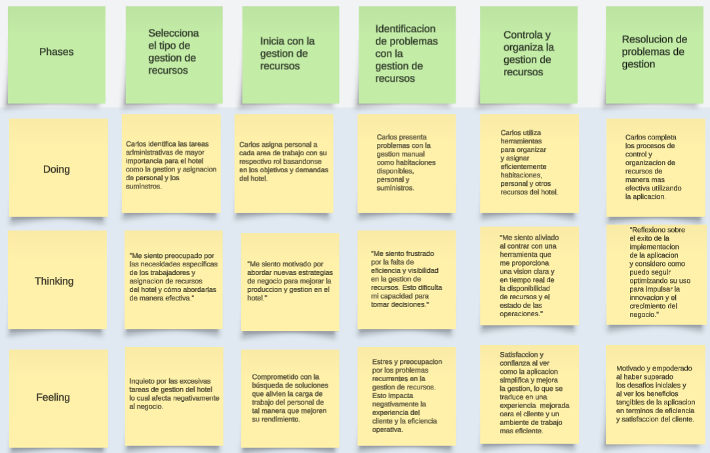
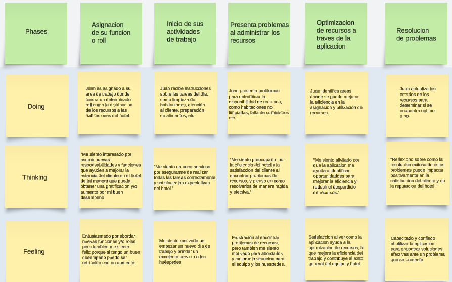

# Universidad Peruana De Ciencas Aplicadas
## 1ASI0572 Desarrollo de Soluciones IOT
### INGENIERÍA DE SOFTWARE

 </img> 

# Informe Trabajo Final
## Docente: Marco Antonio Leon Baca
## Startup: SuiteTechTeam
## Producto: SmartSuit
## Integrantes 

 
 

* **Aaron Elias Acuña Alarcon U202211552**
* **Diego Rafael Cisneros Tafur U20221a715**
* **Ely Rivaldo Cortez Flores U202215313**
* **Francis Daniel Mamani Silva U202219315** 
* **Mariana Alexandra Chambi Mendoza U202217389**

### Abril 2025
### Ciclo: 2025-01
### NRC: 15185

---

 

## Registro de Versiones del Informe

| Versión | Fecha      | Autor      | Descripción de modificación                                                                                         |
| ------- | ---------- | ---------- | ------------------------------------------------------------------------------------------------------------------- |
| 1.0     | 14/04/2025 | Ely Cortez | Se creo la ramificación del repositorio y se adicionó los documentos en su versión inicial previa a la investigacón |

### Project Report Collaboration Insights

URL del repositorio para el reporte del proyecto: https://github.com/SuiteTechTeam/Project-report

Github Collaboration Insights proporciona un cronograma que muestra las principales ramas y los procesos de fusión que han ocurrido. Todas las ramas se han generado siguiendo los principios de GitFlow, lo que garantiza una organización efectiva al utilizar un sistema de control de versiones.

- Aaron Elias Acuña Alarcon (JenayAaron)
- Diego Rafael Cisneros Tafur (Diego22rct)
- Ely Rivaldo Cortez Flores (rivacortez)
- Francis Daniel Mamani Silva (usuarioGithub)
- Mariana Alexandra Chambi Mendoza (MarianaAlexandra05)

Se divieron las siguientes ramas para la colaboración en el proyecto:

- main
- quality
- develop

* #### Entregable TB1

A continuación se presentan los gráficos de colaboración de los integrantes del equipo en el repositorio de nuestro 
primer sprint. Estos gráficos ofrecen una representación visual de la cantidad de contribuciones realizadas por cada
miembro del equipo, junto con la fecha en que se llevaron a cabo. Además, se presenta información sobre la cantidad de 
líneas de código que se han modificado en cada uno de los commits.

## Contenido 

[Registro de Versiones del Informe](#registro-de-versiones-del-informe)

[Project Report Collaboration Insights](#project-report-collaboration-insights)

[Student Outcome](#student-outcome)

[Capítulo I: Introducción](#capítulo-i-introducción)

[1.1 Startup Profile](#11-startup-profile)  
[1.1.1. Descripción de la Startup](#111-descripción-de-la-startup)  
[1.1.2. Perfiles de integrantes del equipo](#112-perfiles-de-integrantes-del-equipo)

[1.2. Solution Profile](#12-solution-profile)  
[1.2.1 Antecedentes y problemática](#121-antecedentes-y-problemática)  
[1.2.2 Lean UX Process.](#122-lean-ux-process)  
[1.2.2.1. Lean UX Problem Statements.](#1221-lean-ux-problem-statements)  
[1.2.2.2. Lean UX Assumptions.](#1222-lean-ux-assumptions)  
[1.2.2.3. Lean UX Hypothesis Statements.](#1223-lean-ux-hypothesis-statements)  
[1.2.2.4. Lean UX Canvas.](#1224-lean-ux-canvas)

[1.3. Segmentos objetivo.](#13-segmentos-objetivo)

[Capítulo II: Requirements Elicitation & Analysis](#capítulo-ii-requirements-elicitation--analysis)

[2.1. Competidores](#21-competidores)  
[2.1.1. Análisis competitivo](#211-análisis-competitivo)  
[2.1.2. Estrategias y tácticas frente a competidores](#211-análisis-competitivo)

[2.2. Entrevistas](#22-entrevistas)  
[2.2.1. Diseño de entrevistas](#221-diseño-de-entrevistas)    
[2.2.3. Análisis de entrevistas](#223-análisis-de-entrevistas)

[2.3. Needfinding](#23-needfinding)  
[2.3.1. User Personas](#231-user-personas)  
[2.3.2. User Task Matrix](#232-user-task-matrix)  
[2.3.3. User Journey Mapping](#233-user-journey-mapping)  
[2.3.4. Empathy Mapping](#234-empathy-mapping)  
[2.3.5. As-is Scenario Mapping](#235-as-is-scenario-mapping)

[2.4. Ubiquitous Language](#24-ubiquitous-language)

[Capítulo III: Requirements Specificatio](#capítulo-iii-requirements-specification)

[3.1. To-Be Scenario Mapping](#31-to-be-scenario-mapping)

[3.2. User Stories](#32-user-stories)

[3.3. Impact Mapping](#33-impact-mapping)

[3.4. Product Backlog](#34-product-backlog)

[Capítulo IV: Solution Software Design](#capítulo-iv-solution-software-design)

[4.1. Strategic-Level Domain-Driven Design](#41-strategic-level-domain-driven-design)  

[4.1.1. EventStorming](#411-eventstorming)  
[4.1.1.1. Candidate Context Discovery](#4111-candidate-context-discovery)  
[4.1.1.2. Domain Message Flows Modeling](#4112-domain-message-flows-modeling)  
[4.1.1.3. Bounded Context Canvases](#4113-bounded-context-canvases)  
[4.1.2. Context Mapping](#412-context-mapping)  
[4.1.3. Software Architecture](#413-software-architecture)  
[4.1.3.1. Software Architecture System Landscape Diagram](#4131-software-architecture-system-landscape-diagram)  
[4.1.3.2. Software Architecture Context Level Diagrams](#4132-software-architecture-context-level-diagrams)  
[4.1.3.3. Software Architecture Container Level Diagrams](#4133-software-architecture-container-level-diagrams)  
[4.1.3.4. Software Architecture Deployment Diagrams](#4134-software-architecture-deployment-diagrams)

[4.2. Tactical-Level Domain-Driven Design](#42-tactical-level-domain-driven-design)

[4.2.1. Bounded Context: <Bounded Context Name>](#421-bounded-context-bounded-context-name)  
[4.2.1.1. Domain Layer](#4211-domain-layer)  
[4.2.1.2. Interface Layer](#4212-interface-layer)  
[4.2.1.3. Application Layer](#4213-application-layer)  
[4.2.1.4. Infrastructure Layer](#4214-infrastructure-layer)  
[4.2.1.5. Bounded Context Software Architecture Component Level Diagrams](#4215-bounded-context-software-architecture-component-level-diagrams)  
[4.2.1.6. Bounded Context Software Architecture Code Level Diagrams](#4216-bounded-context-software-architecture-code-level-diagrams)  
[4.2.1.7. Bounded Context Domain Layer Class Diagrams](#4217-bounded-context-domain-layer-class-diagrams)  
[4.2.1.8. Bounded Context Database Design Diagram](#4218-bounded-context-database-design-diagram)

[4.2.2. Bounded Context: <Bounded Context Name>](#422-bounded-context-bounded-context-name)  
[4.2.2.1. Domain Layer](#4221-domain-layer)  
[4.2.2.2. Interface Layer](#4222-interface-layer)  
[4.2.2.3. Application Layer](#4223-application-layer)  
[4.2.2.4. Infrastructure Layer](#4224-infrastructure-layer)  
[4.2.2.5. Bounded Context Software Architecture Component Level Diagrams](#4225-bounded-context-software-architecture-component-level-diagrams)  
[4.2.2.6. Bounded Context Software Architecture Code Level Diagrams](#4226-bounded-context-software-architecture-code-level-diagrams)  
[4.2.2.7. Bounded Context Domain Layer Class Diagrams](#4227-bounded-context-domain-layer-class-diagrams)  
[4.2.2.8. Bounded Context Database Design Diagram](#4228-bounded-context-database-design-diagram)

[4.2.3. Bounded Context: <Bounded Context Name>](#423-bounded-context-bounded-context-name)  
[4.2.3.1. Domain Layer](#4231-domain-layer)  
[4.2.3.2. Interface Layer](#4232-interface-layer)  
[4.2.3.3. Application Layer](#4233-application-layer)  
[4.2.3.4. Infrastructure Layer](#4234-infrastructure-layer)  
[4.2.3.5. Bounded Context Software Architecture Component Level Diagrams](#4235-bounded-context-software-architecture-component-level-diagrams)  
[4.2.3.6. Bounded Context Software Architecture Code Level Diagrams](#4236-bounded-context-software-architecture-code-level-diagrams)  
[4.2.3.7. Bounded Context Domain Layer Class Diagrams](#4237-bounded-context-domain-layer-class-diagrams)  
[4.2.3.8. Bounded Context Database Design Diagram](#4238-bounded-context-database-design-diagram)

[4.2.4. Bounded Context: <Bounded Context Name>](#424-bounded-context-bounded-context-name)  
[4.2.4.1. Domain Layer](#4241-domain-layer)  
[4.2.4.2. Interface Layer](#4242-interface-layer)  
[4.2.4.3. Application Layer](#4243-application-layer)  
[4.2.4.4. Infrastructure Layer](#4244-infrastructure-layer)  
[4.2.4.5. Bounded Context Software Architecture Component Level Diagrams](#4245-bounded-context-software-architecture-component-level-diagrams)  
[4.2.4.6. Bounded Context Software Architecture Code Level Diagrams](#4246-bounded-context-software-architecture-code-level-diagrams)  
[4.2.4.7. Bounded Context Domain Layer Class Diagrams](#4247-bounded-context-domain-layer-class-diagrams)  
[4.2.4.8. Bounded Context Database Design Diagram](#4248-bounded-context-database-design-diagram)

[4.2.5. Bounded Context: <Bounded Context Name>](#425-bounded-context-bounded-context-name)  
[4.2.5.1. Domain Layer](#4251-domain-layer)  
[4.2.5.2. Interface Layer](#4252-interface-layer)  
[4.2.5.3. Application Layer](#4253-application-layer)  
[4.2.5.4. Infrastructure Layer](#4254-infrastructure-layer)  
[4.2.5.5. Bounded Context Software Architecture Component Level Diagrams](#4255-bounded-context-software-architecture-component-level-diagrams)  
[4.2.5.6. Bounded Context Software Architecture Code Level Diagrams](#4256-bounded-context-software-architecture-code-level-diagrams)  
[4.2.5.7. Bounded Context Domain Layer Class Diagrams](#4257-bounded-context-domain-layer-class-diagrams)  
[4.2.5.8. Bounded Context Database Design Diagram](#4258-bounded-context-database-design-diagram)

[Capítulo V: Solution UI/UX Design](#capítulo-v-solution-uiux-design)

[5.1. Style Guidelines](#51-style-guidelines)  
[5.1.1. General Style Guidelines](#511-general-style-guidelines)  
[5.1.2. Web, Mobile and IoT Style Guidelines](#512-web-mobile-and-iot-style-guidelines)

[5.2. Information Architecture](#52-information-architecture)  
[5.2.1. Organization Systems](#521-organization-systems)  
[5.2.2. Labeling Systems](#522-labeling-systems)  
[5.2.3. SEO Tags and Meta Tags](#523-seo-tags-and-meta-tags)  
[5.2.4. Searching Systems](#524-searching-systems)  
[5.2.5. Navigation Systems](#525-navigation-systems)

[5.3. Landing Page UI Design](#53-landing-page-ui-design)  
[5.3.1. Landing Page Wireframe](#531-landing-page-wireframe)  
[5.3.2. Landing Page Mock-up](#532-landing-page-mock-up)

[5.4. Applications UX/UI Design](#54-applications-uxui-design)  
[5.4.1. Applications Wireframes](#541-applications-wireframes)  
[5.4.2. Applications Wireflow Diagrams](#542-applications-wireflow-diagrams)  
[5.4.3. Applications Mock-ups](#543-applications-mock-ups)  
[5.4.4. Applications User Flow Diagrams](#544-applications-user-flow-diagrams)

[5.5. Applications Prototyping](#55-applications-prototyping)

[Capítulo VI: Product Implementation, Validation & Deployment](#capítulo-vi-product-implementation-validation-deployment)

[6.1. Software Configuration Management](#61-software-configuration-management)  
[6.1.1. Software Development Environment Configuration](#611-software-development-environment-configuration)  
[6.1.2. Source Code Management](#612-source-code-management)  
[6.1.3. Source Code Style Guide & Conventions](#613-source-code-style-guide-conventions)  
[6.1.4. Software Deployment Configuration](#614-software-deployment-configuration)

[6.2. Landing Page, Services & Applications Implementation](#62-landing-page-services-applications-implementation)  
[6.2.X. Sprint 1](#62x-sprint-1)  
[6.2.X.1. Sprint Planning 1](#62x1-sprint-planning-1)  
[6.2.X.2. Aspect Leaders and Collaborators](#62x2-aspect-leaders-and-collaborators)  
[6.2.X.3. Sprint Backlog 1](#62x3-sprint-backlog-n)  
[6.2.X.4. Development Evidence for Sprint Review](#62x4-development-evidence-for-sprint-review)  
[6.2.X.5. Testing Suite Evidence for Sprint Review](#62x5-testing-suite-evidence-for-sprint-review)  
[6.2.X.6. Execution Evidence for Sprint Review](#62x6-execution-evidence-for-sprint-review)  
[6.2.X.7. Services Documentation Evidence for Sprint Review](#62x7-services-documentation-evidence-for-sprint-review)  
[6.2.X.8. Software Deployment Evidence for Sprint Review](#62x8-software-deployment-evidence-for-sprint-review)  
[6.2.X.9. Team Collaboration Insights during Sprint](#62x9-team-collaboration-insights-during-sprint)

[6.3. Validation Interviews](#63-validation-interviews)  
[6.3.1. Diseño de Entrevistas](#631-diseño-de-entrevistas)  
[6.3.2. Registro de Entrevistas](#632-registro-de-entrevistas)  
[6.3.3. Evaluaciones según heurísticas](#633-evaluaciones-según-heurísticas)

[6.4. Video About-the-Product](#64-video-about-the-product)

[Conclusiones](#conclusiones)

[Conclusiones y recomendaciones](#conclusiones-y-recomendaciones)

[Video About-the-Team](#video-about-the-team)

[Bibliografía](#bibliografía)

[Anexos](#anexos)

## Student Outcome

<table>
  <thead>
    <tr>
      <th>Criterio especifico</th>
      <th>Acciones realizadas</th>
      <th>Conclusiones</th>
    </tr>
  </thead>
  <tbody>
    <tr>
     <!--PRIMER CRITERIO DE STUDENT OUTCOME-->
      <td rowspan="17">
        Trabaja en equipo para
        proporcionar liderazgo en
        forma conjunta
      </td>
       <!--ENTREGA TB1-->
      <!-- Estudiante 1 TB1 -->    
      <td>
        <b>Acuña Alarcon, Aaron Elias TB1:</b> 
        Texto
        </td>
        <td rowspan="5"> 
         <b>CONCLUSIÓN DEL ENTREGABLE TB1</b> 
        Texto
      </td>   
    </tr>
    <!-- Estudiante 2 TB1 --> 
    <tr> 
      <td>
      <b>Cisneros Tafur, Diego Rafael TB1:</b>   
      Texto  
    </td>   
    </tr>
    <!-- Estudiante 3 TB1-->
     <tr>   
      <td>
        <b>Cortez Flores, Ely Rivaldo TB1:</b> 
        Texto
      </td>    
    </tr>
    <!-- Estudiante 4 TB1-->
     <tr>   
      <td>
      <b>Chambi Mendoza, Mariana Alexandra TB1:</b> 
       Texto</td>   
    </tr>
    <!-- Estudiante 5 TB1-->
    <tr>   
      <td>
        <b>Mamani Silva, Francis Daniel TB1:</b> 
        Texto
      </td>   
    </tr>
    <tbody>
    <tr>
     <!--SEGUNDO CRITERIO DE STUDENT OUTCOME-->
      <td rowspan="17">
        Crea un entorno colaborativo e
        inclusivo, establece metas,
        planifica tareas y cumple
        objetivos.  
      </td>
       <!--ENTREGA TB1-->
      <!-- Estudiante 1 TB1 -->    
      <td>
        <b>Acuña Alarcon, Aaron Elias TB1:</b> 
        Texto
        </td>
        <td rowspan="5"> 
         <b>CONCLUSIÓN DEL ENTREGABLE TB1</b> 
        Texto
      </td>   
    </tr>
    <!-- Estudiante 2 TB1 --> 
    <tr> 
      <td>
      <b>Cisneros Tafur, Diego Rafael TB1:</b>   
      Texto  
    </td>   
    </tr>
    <!-- Estudiante 3 TB1-->
     <tr>   
      <td>
        <b>Cortez Flores, Ely Rivaldo TB1:</b> 
        Texto
      </td>    
    </tr>
    <!-- Estudiante 4 TB1-->
     <tr>   
      <td>
      <b>Chambi Mendoza, Mariana Alexandra TB1:</b> 
       Texto</td>   
    </tr>
    <!-- Estudiante 5 TB1-->
    <tr>   
      <td>
        <b>Mamani Silva, Francis Daniel TB1:</b> 
        Texto
      </td>   
    </tr>
</table>

## 1.1. Startup Profile
  
### 1.1.1. Descripción de la Startup

#### 1.1.2. Perfiles de integrantes del equipo

## 1.2. Solution Profile

### 1.2.1 Antecedentes y problemática

### 1.2.2 Lean UX Process.

#### 1.2.2.1. Lean UX Problem Statements.

#### 1.2.2.2. Lean UX Assumptions.

#### 1.2.2.3. Lean UX Hypothesis Statements.

#### 1.2.2.4. Lean UX Canvas.

## 1.3. Segmentos objetivo.

A partir de nuestros usuarios asumidos, logramos encontrar nuestros segmentos objetivos a los que va dirigido nuestra solución.

**Usuarios:**

- **Propietarios y Gerentes de Hoteles:**

  Se ubican principalmente en áreas urbanas y turísticas de todo el mundo, mayormente en ciudades importantes y destinos turísticos.

  Son altamente dedicados a su negocio, priorizando la eficiencia y rentabilidad de su hotel. También tienen una necesidad de control, buscando herramientas que les permitan tener un control total sobre las facetas de su negocio. Además, mantienen un deseo continuo de mejorar, para asegurar el éxito de su hotel y satisfacer la experiencia del cliente.

  En su mayoría, son adultos de entre 30 y 60 años. El nivel educativo varía, desde propietarios con educación empresarial formal, hasta gerentes con experiencia laboral en la industria hotelera. Por último, pueden tener una amplia experiencia en la gestión hotelera o ser propietarios recientes que buscan optimizar su negocio.

- **Personal de Trabajo:**

  Se ubican principalmente en áreas urbanas y turísticas de todo el mundo, mayormente en ciudades importantes y destinos turísticos.

  Tienen una fuerte dedicación al servicio al cliente y a proporcionar una experiencia excepcional a los huéspedes. También, son capaces de adaptarse a una variedad de tareas y situaciones en un entorno dinámico y exigente. Además, valoran la colaboración y comunicación efectiva entre ellos y sus superiores, para garantizar el buen funcionamiento del hotel.

  Mayormente son adultos jóvenes a adultos de mediana edad, con amplia experiencia laboral. También, varían en su nivel educativo, desde aquellos con educación secundaria hasta aquellos con formación específica en hospitalidad y turismo. Por último, su experiencia laboral varía, desde aquellos que recién empiezan, hasta aquellos que ya tienen experiencia personal en hoteles.

# Capítulo II: Requirements Elicitation & Analysis
En este capítulo, nos centraremos en los requerimientos que necesita cumplir nuestra solución para que sea viable, y los análisis necesarios.

## 2.1. Competidores.

Empezando con los competidores a los que nos enfrentaremos con nuestra solución, su análisis competitivo, junto a nuestras estrategias y tácticas para hacerlas frente.

Facebook (Indirecto):  
En Facebook, los usuarios pueden crear perfiles personales, agregar amigos, publicar actualizaciones de estado, compartir fotos y videos, unirse a grupos y páginas, enviar mensajes privados, participar en eventos, jugar juegos y muchas otras actividades. La plataforma se ha expandido enormemente con el tiempo, integrando funciones como Facebook Marketplace (un mercado en línea), Facebook Watch (una plataforma de vídeo), y Facebook Messenger (una aplicación de mensajería instantánea). Lo cual implica que los gerentes de hoteles busquen empresas que brinden soluciones por medio de publicaciones en dicha plataforma.

Mercado Libre (Indirecto):  
Siendo la plataforma líder de comercio electrónico de América Latina, Mercado libre ofrece la compra y venta de artículos a precio fijo. La gestión hotelera también entra en la lista puesto que se promocionan venta de sistemas y código fuente que ayudan y facilitan a buen precio la gestión hotelera.

Xafiro (Directo):  
Xafiro es un software hotelero, que ahorra tiempo y optimiza la gestión de las operaciones diarias como registro de clientes, reservas, checkin y checkout de habitaciones, venta de productos, entre otros. Dicha empresa es competencia directa porque brinda la solución que ofrecemos como empresa.

Binz 360 (Directo):  
Binz 360 es una empresa que se encarga de la gestión de los recursos hoteleros, control de clientes y reportes de ingresos a un buen precio. Dicha empresa es competencia directa porque brinda la solución que planteamos a un precio económico.

### 2.1.1. Análisis competitivo.

| ¿Por qué llevar a cabo este análisis? | Sweet Manager |  Facebook(Indirecto) |  Mercado Libre(Indirecto) |  Xafiro(Directo) |  Binz360(Directo) |
|---------------------------------------|----------|-----------|------------|------------|------------|
| **Overview**                          | Sweet Manager es una aplicación integral de gestión hotelera diseñada para simplificar y optimizar todas las operaciones relacionadas con la administración de un hotel | Plataforma de redes sociales utilizada para la promoción y publicidad de empresas hoteleras. Ofrece una amplia gama de herramientas de marketing y publicidad para llegar a una amplia audiencia. | Plataforma líder de comercio electrónico que ofrece sistemas y códigos fuente relacionados con la gestión hotelera. Proporciona opciones para la compra de productos y servicios que pueden mejorar la eficiencia en la gestión hotelera. | Solución de software hotelero que ahorra tiempo y optimiza la gestión de operaciones diarias. Ofrece características similares a Sweet Manager, como registro de clientes, reservas y gestión de inventarios. | Empresa especializada en la gestión de recursos hoteleros y control de clientes. Ofrece una solución competitiva en términos de gestión hotelera a un precio económico. |
| **Ventaja Competitiva**               | Ofrece una solución integral para la gestión hotelera, desde seguimiento de ingresos y gastos hasta gestión de proveedores y clientes. Flexibilidad y accesibilidad, permitiendo a los administradores gestionar correctamente su negocio desde cualquier lugar y en cualquier momento. | Alcance masivo y capacidad de segmentación precisa del público objetivo. | Amplia variedad de productos y servicios disponibles. | Enfoque específico en la eficiencia de las operaciones diarias del hotel | Precio asequible para hoteles pequeños y medianos |
| **Mercado Objetivo**                  | Gerentes y propietarios de hoteles de todos los tamaños buscan una solución eficiente y completa para la gestión de su negocio. | Hoteles de todos los tamaños que buscan aumentar su visibilidad en línea. | Propietarios de hoteles y gerentes que buscan soluciones de gestión. | Hoteles de mediano a gran tamaño que buscan una solución completa y eficiente. | Hoteles independientes y pequeñas cadenas hoteleras. |
| **Estrategias de marketing**               | Campañas dirigidas en redes sociales y plataformas de anuncios digitales para llegar a la audiencia objetivo. Colaboraciones con asociaciones hoteleras y participación en eventos de la industria para aumentar la visibilidad y credibilidad de la marca. | Publicidad segmentada. Uso de contenido visual para atraer a los usuarios. | Promoción de productos relacionados con la gestión hotelera. Publicidad dirigida a profesionales de la industria hotelera. | Colaboración con asociaciones hoteleras en redes sociales. Campañas en redes sociales dirigidas a gerentes hoteleros. | Enfoque en el ahorro de costos y eficiencia operativa. Uso de marketing de contenidos para educar sobre la importancia de la gestión hotelera. |
| **Productos & Servicios**               | Sweet Manager ofrece una gama de características, incluyendo seguimiento de ingresos y gastos, control de inventarios, gestión de proveedores y clientes. | Plataforma de redes sociales con diversas opciones de publicidad y promoción. Herramientas de análisis para medir el rendimiento de las campañas | Variedad de sistemas y códigos fuente relacionados con la gestión hotelera disponibles para la compra. Opciones de precio variadas para adaptarse a diferentes presupuestos | Ofrece una variedad de características para la gestión hotelera. Precios competitivos y opciones de personalización | Solución completa para la gestión hotelera con énfasis en la relación calidad-precio. Modelo de precios simple y transparente |
| **Precios & Costos**                           | Ofrecido como servicio de suscripción mensual o anual con planes escalables según el tamaño y las necesidades del hotel. | No ofrece un costo. | No ofrece un costo. | Ofrece un precio bastante accesible y competitivo en el mercado. | Ofrece un precio cómodo para las pequeñas y medianas empresas. |
| **Canales de distribución (Web o móvil)**                           | La aplicación está disponible tanto en versiones web como móviles para una mayor accesibilidad. | Principalmente a través de la plataforma de Facebook y sus herramientas de publicidad | Principalmente a través de la plataforma de Mercado Libre. | Principalmente ventas directas y demostraciones en línea | Principalmente ventas directas y a través de socios de distribución. |
| **Fortalezas**                           | Solución eficaz, sencilla y rápida para la gestión hotelera. Interfaz intuitiva y fácil de usar. | Alcance masivo y herramientas de segmentación. | Amplia variedad de productos y servicios. | Solución especializada en operaciones diarias de hoteles. | Precio competitivo. |
| **Debilidades**                           | Posible competencia de grandes empresas en el mercado de gestión hotelera | Menos especialización en la industria hotelera. | Menos enfoque en soluciones específicas para la industria hotelera. | Menos reconocimiento de marca que competidores establecidos. | Menos funcionalidades avanzadas en comparación con competidores más establecidos. |
| **Oportunidades**                           | Crecimiento en la industria hotelera y demanda de soluciones eficientes de gestión. | Uso de datos para personalizar la publicidad. | Expansión a nuevos mercados verticales. | Expansión internacional. | Expansión a nuevos mercados. |
| **Amenazas**                           | Competencia directa de otras empresas de software de gestión hotelera | Posible cambio en algoritmos de redes sociales que afecten la visibilidad de las empresas. | Posible competencia de otros mercados en línea. | Competencia directa de otros proveedores de software. | Posible competencia de proveedores de software con precios aún más bajos |

### 2.1.2. Estrategias y tácticas frente a competidores.

## 2.2. Entrevistas.

### 2.2.1. Diseño de entrevistas.

### 2.2.2. Registro de entrevistas.

### 2.2.3. Análisis de entrevistas.

## 2.3. Needfinding.
Para tener una mejor idea de cómo será la experiencia del usuario con nuestro producto, utilizaremos las herramientas de User Persona, User Task Matrix, User Journey Mapping, Empathy Mapping y As-is Scenario Mapping.

### 2.3.1. User Personas.

**Segmento de gerentes:**  

**Segmento de trabajadores:**  

### 2.3.2. User Task Matrix.

| Tarea                                                  | Gerente (Frecuencia / Importancia) | Empleado (Frecuencia / Importancia) |
| ------------------------------------------------------ | ---------------------------------- | ----------------------------------- |
| Crear una cuenta                                       | Alta - Alta                        | Alta - Alta                         |
| Seguimiento de ingresos y gastos                       | Media - Alta                       | Baja - Media                        |
| Gestión de inventarios                                 | Media - Alta                       | Alta - Alta                         |
| Coordinación con proveedores                           | Alta - Alta                        | Baja - Baja                         |
| Capacitación del personal                              | Alta - Alta                        | Media - Alta                        |
| Evaluación de desempeño del personal                   | Alta - Alta                        | Alta - Alta                         |
| Preparación de informes y análisis de datos            | Media - Alta                       | Alta - Alta                         |
| Recibir notificaciones de baja en el inventario        | Alta - Alta                        | Baja - Media                        |
| Asignar tareas a empleados                             | Alta - Alta                        | Alta - Alta                         |
| Visualizar la ocupación de habitaciones en tiempo real | Alta - Alta                        | Media - Media                       |
| Administrar permisos de los empleados                  | Alta - Alta                        | Baja - Alta                         |
| Programar turnos de trabajo                            | Alta - Alta                        | Alta - Alta                         |
| Notificaciones de cambio de agenda                     | Media - Alta                       | Baja - Baja                         |
| Reportar problemas a la gerencia                       | Alta - Alta                        | Media - Alta                        |
| Registrar el check-in y check-out del huésped          | Alta - Alta                        | Alta - Alta                         |
| Notificaciones de comentarios                          | Media - Alta                       | Baja - Alta                         |

Tareas con mayor frecuencia e importancia:  
Crear una cuenta: Esta tarea es crucial tanto para el gerente como para el empleado, ya que implica establecer una identidad en el sistema y acceso a las herramientas.  
Seguimiento de ingresos y gastos: Esta tarea es de alta importancia para el gerente, ya que implica la supervisión de la salud financiera del hotel y la toma de decisiones informadas. Para el empleado, aunque puede no estar directamente involucrado en esta tarea a diario, entender los ingresos y gastos del hotel puede ayudar en la planificación y ejecución de sus responsabilidades.  
Gestión de inventarios: Tanto el gerente como el empleado realizan esta tarea con alta frecuencia e importancia, ya que asegura que el hotel tenga los suministros necesarios para operar sin problemas. La falta de inventario puede afectar negativamente la experiencia del cliente y la eficiencia del hotel.  
Coordinación con proveedores: Esta tarea es de alta importancia para el gerente, ya que garantiza la disponibilidad oportuna de suministros esenciales. Aunque para el empleado puede tener una frecuencia menor, sigue siendo crucial para mantener la continuidad operativa.  
Asignar tareas a empleados: Esta tarea es fundamental para ambos usuarios, ya que garantiza que el trabajo se distribuya de manera eficiente y que todas las actividades necesarias para el funcionamiento del hotel se completen a tiempo.  
Programar turnos de trabajo: La programación de turnos es esencial para garantizar una cobertura adecuada en todas las áreas del hotel, lo que contribuye a la satisfacción del cliente y al funcionamiento fluido del negocio.  
Registrar el check-in y el check-out del huésped: Estas tareas son cruciales para ambos usuarios, ya que afectan directamente la experiencia del cliente y la gestión de la ocupación de las habitaciones del hotel.  
Principales diferencias y coincidencias entre lo realizado por los User Personas:  
Diferencias: 
La coordinación con proveedores es una tarea de alta importancia para el gerente pero de baja importancia para el empleado. Esto refleja el nivel de responsabilidad y la naturaleza estratégica de las decisiones que el gerente toma en comparación con las tareas más operativas del empleado.  
La capacitación del personal es una tarea de alta importancia para el gerente, ya que influye en la calidad del servicio y la satisfacción del cliente, pero es de media importancia para el empleado, que puede recibir la capacitación pero no necesariamente esté involucrado en su planificación y ejecución.  
Coincidencias: 
Tanto el gerente como el empleado participan en la evaluación del desempeño del personal, lo que destaca la importancia compartida de garantizar un equipo bien capacitado y motivado para brindar un servicio de calidad.  
La preparación de informes y análisis de datos es una tarea de alta importancia para ambos roles, lo que resalta la necesidad de tomar decisiones basadas en datos para mejorar la eficiencia operativa y la experiencia del cliente.

### 2.3.3. User Journey Mapping.

User Journey Map - Carlos Rebagliati - Gerente (As-Is):  
Inicio del día: El gerente comienza el día revisando los informes financieros y preparando la agenda para el día. Se siente estresado por la cantidad de tareas pendientes y la presión para garantizar que todo funcione sin problemas.  
Gestión de inventarios: El gerente se enfrenta a la tarea de revisar el inventario y hacer pedidos a los proveedores según sea necesario. Se siente frustrado por la falta de un sistema integrado que facilite esta tarea, y aburrido por la tarea en sí.  
Coordinación del personal: El gerente asigna tareas al personal y revisa los horarios. Se siente abrumado por la cantidad de comunicación necesaria para coordinar a todos los empleados.  
Comunicación con proveedores: El gerente se comunica con los proveedores para hacer seguimiento de los pedidos y resolver cualquier problema de entrega. Se siente frustrado por la falta de eficiencia en la comunicación.  
Análisis de datos y toma de decisiones: El gerente revisa los informes y datos disponibles para tomar decisiones informadas para el hotel. Se siente satisfecho cuando encuentra información útil, pero también preocupado por la falta de herramientas para un análisis más profundo, terminando con una sensación de aceptación por ser la última tarea del día.

User Journey Map - Juan Guarnizo - Empleado (As-Is):  
Inicio del turno: El empleado comienza su turno revisando los horarios y recibiendo instrucciones del gerente. Se siente preparado para comenzar su jornada laboral.  
Atención al Cliente: El empleado atiende a los clientes, toma pedidos y proporciona asistencia según sea necesario. Se esfuerza por brindar un servicio amable y eficiente, pero termina sintiéndose aburrido o frustrado.  
Realización de tareas asignadas: El empleado completa las tareas asignadas, como limpieza de habitaciones, reposición de suministros o preparación de alimentos. Termina furioso cuando no obtiene una idea clara de los suministros y recursos faltantes.  
Comunicación con el Equipo: El empleado se comunica con otros miembros del equipo para coordinar actividades o resolver problemas. Se esfuerza por mantener una comunicación clara y efectiva con sus colegas, pero se frustra cuando ocurren malentendidos.  
Final del día: El empleado finaliza su turno, informa al gerente sobre cualquier problema o tarea pendiente, y se prepara para partir. Se siente resignado al terminar, especialmente cuando faltan tareas por completar y es a causa de la mala organización de recursos o suministros.

### 2.3.4. Empathy Mapping.

**Segmento gerente:**

**Segmento trabajador:**

### 2.3.5. As-is Scenario Mapping.
En esta sección se presentan los Scenario Mapping para los segmentos de gerentes y trabajadores, que describen cómo son las experiencias actuales de los usuarios en sus tareas diarias.

El link para ambos Scenario Mapping es: [Link de enlace](https://lucid.app/lucidspark/6d541f3f-440a-40fc-b3a7-1461742dc65e/edit?viewport_loc=2162%2C964%2C2846%2C1413%2C0_0&invitationId=inv_0e4e4622-20f9-43c4-ac8a-c034737fb585)

**Segmento gerente:**

**Segmento trabajador:**

## 2.4. Ubiquitous Language.
En esta sección, nos centraremos en definir el significado de ciertos términos utilizados en el ambiente de nuestra solución en la gestión hotelera.

- **Check-In**  
  **Definition:** Process by which a guest registers their arrival at the hotel, provides the necessary information and receives the key to their room.

- **Check-Out**  
  **Definition:** Process by which a guest completes their stay at the hotel, makes final payment, and returns the room key.

- **Role**  
  **Definition:** Worker role to a specific area.

- **Staff**  
  **Definition:** They represent all hotel workers. They perform various tasks and responsibilities needed for the organization to operate.

- **Reservation**  
  **Definition:** Booking of a room by a guest.

- **Occupancy**  
  **Definition:** The percentage of rooms occupied in the hotel over a specified period of time.

- **Rate**  
  **Definition:** The price per night for a room.

- **House Rules**  
  **Definition:** Policies and regulations of the hotel that guests are required to follow.

- **Housekeeping**  
  **Definition:** The department responsible for cleaning and maintaining the rooms.

- **Inventory Management**  
  **Definition:** The process of overseeing and controlling the hotel's supply of goods and materials, ensuring that adequate stock levels are maintained while minimizing costs and waste.

- **Asset Tracking**  
  **Definition:** The practice of monitoring and managing the hotel's physical assets, such as furniture, equipment, and fixtures, to ensure they are utilized efficiently and maintained properly.

- **Task Management**  
  **Definition:** The organization and tracking of tasks and responsibilities within the hotel, ensuring that deadlines are met and workflows are optimized.

- **Type of Reservation**  
  **Definition:** List of types of reservations.

- **Staff Scheduling**  
  **Definition:** The process of creating and managing work schedules for hotel employees, taking into account factors such as shift rotations, staffing levels, and employee availability.

- **Resource Allocation**  
  **Definition:** The allocation and distribution of resources, such as staff, equipment, and funds, to different areas of the hotel based on operational needs and priorities.

- **Vendor Management**  
  **Definition:** The coordination and oversight of relationships with external suppliers and vendors, including negotiating contracts, monitoring performance, and ensuring timely delivery of goods and services.

- **Quality Control**  
  **Definition:** The process of monitoring and evaluating the quality of products and services offered by the hotel, identifying areas for improvement, and implementing measures to maintain or enhance quality standards.

- **Cost Management**  
  **Definition:** The control and optimization of expenses within the hotel, including labor costs, operating expenses, and capital expenditures, to maximize profitability and efficiency.

- **Data Analytics**  
  **Definition:** The use of data analysis techniques to extract insights and patterns from hotel operations data, enabling informed decision-making and strategic planning.

- **Risk Management**  
  **Definition:** The identification, assessment, and mitigation of risks when resources are limited at any moment.

# Capítulo III: Requirements Specification.
En este capítulo, nos centraremos en definir los requerimientos que debemos cumplir para el exito de nuestra solución.

## 3.1. To-Be Scenario Mapping.

En este apartado se presentan los To-Be Scenario Mapping para los segmentos de gerentes y trabajadores, que describen cómo serán las interacciones y tareas de los usuarios con el sistema de gestión hotelera una vez implementado.Estos mapas proporcionan una visión general de las funcionalidades y características que se espera que tenga el producto final, y sirven como guía para el diseño y desarrollo del sistema.

Segmento 1:

El To-Be Scenario Mapping para el segmento Gerentes.

Segmento 2:

El To-Be Scenario Mapping para el segmento Trabajadores.

## 3.2. User Stories.

Redactamos las historias de usuario para el sistema de gestión hotelera basándonos en las necesidades y desafíos identificados en las entrevistas y el análisis de los segmentos de gerentes y trabajadores. Las historias de usuario describen las funcionalidades y características que los usuarios finales esperan del sistema, y se utilizan para guiar el diseño y desarrollo del producto.

# Epicas

| EPX  | Épica                                      | Descripción                                                                                                                                     | Criterios de Aceptación                                                                                                                                                                                                                                                     | Relacionado con (Epic ID) |
| ---- | ------------------------------------------ | ----------------------------------------------------------------------------------------------------------------------------------------------- | --------------------------------------------------------------------------------------------------------------------------------------------------------------------------------------------------------------------------------------------------------------------------- | ------------------------- |
| EP01 | Información del producto                   | Como visitante del sitio web, quiero obtener información relacionada al producto que se ofrece.                                                 | Dado que el visitante está en la página de inicio   Cuando observa la información del producto que se está ofreciendo   Entonces obtiene una mejor visión de lo que ofrece la empresa.   Y se registra o considera registrarse como usuario.                       | -                         |
| EP02 | Crear cuenta                               | Como gerente del hotel/hostal quiero crear una cuenta para utilizar InnControl (aplicación).                                                    | Dado que el usuario se encuentra en el Login   Cuando presiona en el botón "SignUp".   E ingresa sus datos.   Entonces se le presentará con el plan que se acomoda mejor a las necesidades del negocio   Y realiza el pago.<Y> Crea su cuenta de gerente.       | -                         |
| EP03 | Gestionar Habitaciones del Hotel           | Como gerente, quiero poder revisar el estado de las habitaciones.                                                                               | Dado que el usuario está en la ruta de habitaciones   Cuando revisa las habitaciones creadas   Entonces puede ver los estados, reservaciones, el tipo de habitación, el número de habitación y el cliente   Y se muestra también un botón para crear habitaciones. | -                         |
| EP04 | Gestionar Inventario                       | Como gestor, quiero gestionar el inventario del hotel.                                                                                          | Dado que el usuario tiene acceso al sistema de gestión de inventario en la ruta inventario   Cuando revisa los niveles de inventario   Entonces puede agregar, actualizar o eliminar elementos del inventario   Y se reflejan los cambios                          | -                         |
| EP05 | Gestionar Tareas                           | Como gerente, quiero gestionar las tareas asignadas a los empleados.                                                                            | Dado que el usuario tiene acceso para crear, editar, finalizar o eliminar tareas   Cuando revisa la ruta de tareas   Entonces puede realizar las acciones necesarias para gestionarlas.                                                                               | -                         |
| EP06 | Gestionar Mensajes                         | Como gerente, quiero gestionar los mensajes enviados entre empleados.                                                                           | Dado que el usuario tiene acceso para crear, revisar o eliminar mensajes   Cuando accede a la ruta de mensajes   Entonces puede realizar las acciones necesarias para gestionarlos.                                                                                   | -                         |
| EP07 | Uso de APIs/BD                             | Como desarrollador de InnControl, quiero tener acceso a la información de la base de datos para poder realizar las operaciones CRUD.            | Dado que el usuario necesita realizar operaciones CRUD   Cuando realiza la conexión con la Base de datos en MySql   Entonces se aplican la conexión y se permite el acceso en la base de datos.                                                                       | -                         |
| EP08 | Seguridad de datos                         | Como gerente, quiero que la información del hotel esté asegurada así como mi cuenta.                                                            | Dado que el usuario tiene una cuenta   Cuando decide ingresar a la aplicación   Y se realiza la verificación exitosa JWT.   Entonces logra iniciar sesión de manera correcta.                                                                                      | -                         |
| EP09 | Monitoreo inteligente del entorno          | Como gerente, quiero visualizar en tiempo real la temperatura en cada habitación, para asegurar la comodidad de los huéspedes.                  | Dado que el sistema está conectado a sensores de temperatura  Cuando el gerente accede al panel de habitaciones  Entonces puede visualizar la temperatura actual de cada una en tiempo real.                                                                                | -                         |
| EP10 | Control de accesos automatizado y seguro   | Como gerente, quiero que los huéspedes puedan acceder a sus habitaciones usando tarjetas inteligentes, para ofrecerles una experiencia moderna. | Dado que el huésped ha realizado el check-in  Cuando se le asigna una tarjeta RFID  Entonces puede ab rir la puerta de su habitación al acercarla al lector correspondiente.                                                                                                | Check-in                  |
| EP11 | Detección de riesgos y consumo inteligente | Como gerente, quiero recibir alertas sísmicas para activar protocolos de emergencia y proteger a los huéspedes.                                 | Dado que el sensor detecta movimiento sísmico  Cuando se supera el umbral de seguridad  Entonces se genera una alerta para el gerente y personal de seguridad.                                                                                                              | Sistema de alertas        |

# User Stories

| HUX  | Historia de Usuario                                           | Descripción                                                                                                                                                  | Criterios de Aceptación                                                                                                                                                                                                                                                                                           | Relacionado con (Epic ID) |
| ---- | ------------------------------------------------------------- | ------------------------------------------------------------------------------------------------------------------------------------------------------------ | ----------------------------------------------------------------------------------------------------------------------------------------------------------------------------------------------------------------------------------------------------------------------------------------------------------------- | ------------------------- |
| HU01 | Obtener información de la empresa                             | Como visitante del sitio web, quiero obtener más información sobre la empresa a cargo del producto.                                                          | Dado que el visitante se encuentra en la sección de nosotros   Cuando observa la información relevante sobre la empresa   Entonces se interesa en saber más del producto   Y se registra como usuario.                                                                                                   | EP01                      |
| HU02 | Informarse sobre los beneficios del producto                  | Como visitante del sitio web, quiero informarme sobre los beneficios del producto ofrecido.                                                                  | Dado que el visitante se encuentra en la sección de beneficios   Cuando observa los beneficios que se ofrecen al usar nuestra solución   Entonces se interesa en saber más del producto   Y se registra como usuario.                                                                                    | EP01                      |
| HU03 | Conocer los testimonios de los clientes pasados               | Como visitante, quiero acceder a testimonios de clientes anteriores para evaluar la experiencia y el desempeño del personal.                                 | Dado que el visitante se encuentra en la sección de testimonios   Cuando observa los diferentes testimonios   Entonces evalúa la experiencia y desempeño del personal basado en los comentarios de clientes previos.   Y considera registrarse como usuario.                                             | EP01                      |
| HU04 | Informarse sobre los diferentes planes de precio del producto | Como visitante, quiero conocer los diferentes planes de precio disponibles para el producto ofrecido.                                                        | Dado que el visitante se encuentra en la sección de planes de precios disponibles   Cuando visualiza los diferentes planes   Entonces puede entender las opciones disponibles y tomar decisiones informadas sobre el producto.   Y registrarse como usuario.                                             | EP01                      |
| HU05 | Contactar con la empresa                                      | Como visitante, quiero poder contactarme fácilmente con la empresa desde la página de inicio.                                                                | Dado que el visitante accede a la sección de contacto   Cuando observa los diferentes medios para contactarse con nosotros   Entonces se comunicará con nosotros rápidamente.                                                                                                                               | EP01                      |
| HU06 | Crear cuenta empleado                                         | Como empleado, quiero crear mi cuenta de empleado.                                                                                                           | Dado que el usuario se encuentra en el login   Cuando selecciona que quiere crear una cuenta con el botón signup   E ingresa el correo del hotel   E ingresa sus datos   Entonces se muestra un mensaje de bienvenida   Y se muestra el dashboard de empleado.                                     | EP02                      |
| HU07 | Crear cuenta gerente                                          | Como gerente, quiero crear mi cuenta de gerente para poder gestionar a mis empleados.                                                                        | Dado que se paga el plan   Cuando el usuario ingrese sus datos de hotel y gerente   Entonces se muestra un mensaje de bienvenida   Y se muestra el dashboard de gerente.                                                                                                                                 | EP02                      |
| HU08 | Cambiar estado de habitación                                  | Como gerente, quiero realizar un cambio al estado de la habitación.                                                                                          | Dado que el usuario ingresa a la ruta de Habitaciones  Cuando el usuario usa el botón para editar   Y selecciona uno de los estados en el popup   Entonces el estado de la habitación se actualiza.                                                                                                      | EP03                      |
| HU09 | Cambiar estado de habitación (Empleado)                       | Como empleado, quiero cambiar el estado de la habitación de mi tarea para notificar que ya terminé mi tarea.                                                 | Dado que el usuario se encuentra en la ruta de habitaciones.   Cuando el usuario termina con su tarea   Y usa el botón para cambiar el estado de la habitación.  Entonces el estado de la habitación se actualiza.                                                                                       | EP03                      |
| HU10 | Crear habitaciones                                            | Como gerente, quiero crear nuevas habitaciones en el sistema.                                                                                                | Dado que el usuario tiene acceso para crear nuevas habitaciones en la ruta habitaciones   Cuando ingresa los detalles de la habitación (tipo, número, etc.)   Entonces la habitación se añade al sistema y se refleja en la lista de habitaciones.                                                          | EP03                      |
| HU11 | Crear ítem                                                    | Como gestor, quiero agregar un nuevo ítem al inventario.                                                                                                     | Dado que el usuario tiene acceso para agregar ítems al inventario en la ruta de inventario   Cuando ingresa los detalles del nuevo ítem (nombre, cantidad, etc.)   Entonces el ítem se añade al inventario.  Y se muestra en la ruta Inventario.                                                         | EP04                      |
| HU12 | Actualizar ítem                                               | Como gestor, quiero actualizar la información de un ítem en el inventario.                                                                                   | Dado que el usuario tiene acceso para actualizar la información de un ítem   Cuando selecciona el ítem a actualizar   Y modifica sus detalles (cantidad, descripción, etc.)   Entonces los cambios se reflejan en el inventario.                                                                         | EP04                      |
| HU13 | Eliminar ítem                                                 | Como gestor, quiero eliminar un ítem del inventario.                                                                                                         | Dado que el usuario tiene acceso para eliminar ítems del inventario   Cuando selecciona el ítem a eliminar   Y confirma que quiere eliminar el ítem   Entonces el ítem se elimina del inventario.                                                                                                        | EP04                      |
| HU14 | Actualizar ítem                                               | Como empleado, quiero actualizar la información de un ítem en el inventario asignado a mi tarea.                                                             | Dado que el usuario está en Inventario   Cuando el usuario selecciona la opción de editar un ítem asignado   Y modifica los detalles permitidos (cantidad)   Entonces los cambios se reflejan en el sistema de gestión de inventario.                                                                    | EP04                      |
| HU15 | Crear tarea                                                   | Como gerente, quiero crear una nueva tarea para asignar a un empleado.                                                                                       | Dado que el usuario se encuentra en la ruta tareas   Cuando presiona el botón para agregar una tarea   Y define los detalles de la tarea (descripción, empleado asignado, fecha límite, etc.)   Entonces la tarea se añade a la ruta de tareas.                                                          | EP05                      |
| HU16 | Finalizar tarea                                               | Como empleado, quiero marcar una tarea como completada una vez que la haya finalizado.                                                                       | Dado que el usuario se encuentra en la ruta tareas   Cuando selecciona una tarea   Y cambia su estado a "DONE"   Entonces se actualiza en la ruta tareas.                                                                                                                                                | EP05                      |
| HU17 | Eliminar tarea                                                | Como gerente, quiero eliminar una tarea que ya no sea necesaria.                                                                                             | Dado que el usuario se encuentra en tareas   Cuando selecciona eliminar una tarea   Y presiona en el botón para eliminar   Entonces la tarea se elimina.                                                                                                                                                 | EP05                      |
| HU18 | Asignar/Editar tarea                                          | Como gerente, quiero asignar o editar tareas para distribuir las responsabilidades entre los empleados.                                                      | Dado que el usuario tiene acceso para asignar o editar tareas, en la ruta tareas   Cuando selecciona una tarea existente o crea una tarea   E ing resa o modifica los detalles (empleado asignado, descripción, etc.)   Entonces la tarea se actualiza o se asigna a un empleado.                        | EP05                      |
| HU19 | Actualizar estado de tarea                                    | Como empleado, quiero cambiar el estado de una tarea asignada para reflejar su progreso.                                                                     | Dado que el usuario se encuentra en la ruta tareas   Cuando selecciona una tarea asignada   Y cambia el estado de la tarea a "In Progress" o "Completed"   Entonces la tarea se actualiza en la ruta tareas.                                                                                             | EP05                      |
| HU20 | Asignar tareas                                                | Como gerente, quiero asignar una tarea a un empleado específico.                                                                                             | Dado que el usuario tiene acceso para asignar tareas   Cuando selecciona una tarea   Y especifica el empleado asignado en el diálogo   Entonces la tarea se asigna a un empleado específico y los detalles se actualizan.                                                                                | EP05                      |
| HU21 | Enviar mensaje                                                | Como gerente, quiero enviar un mensaje a un empleado.                                                                                                        | Dado que el usuario tiene acceso para redactar mensajes en la ruta mensajes   Cuando redacta   Y envía el mensaje   Entonces el mensaje se envía con éxito.   Y se muestra en la ruta de mensajes del remitente.                                                                                      | EP06                      |
| HU22 | Enviar mensaje                                                | Como empleado, quiero enviar un mensaje a un gerente.                                                                                                        | Dado que el usuario tiene acceso para redactar mensajes en la ruta mensajes   Cuando redacta   Y envía el mensaje   Entonces el mensaje se envía con éxito.   Y se muestra en la ruta de mensajes del remitente.                                                                                      | EP06                      |
| HU23 | Revisar mensaje                                               | Como gerente, quiero revisar los mensajes recibidos de empleados.                                                                                            | Dado que el usuario tiene acceso para la ruta mensajes   Cuando presiona la campana   Entonces puede ver los mensajes recibidos y sus detalles filtrados.                                                                                                                                                   | EP06                      |
| HU24 | Revisar mensaje                                               | Como empleado, quiero revisar los mensajes recibidos del gerente.                                                                                            | Dado que el usuario tiene acceso para la ruta mensajes   Cuando presiona la campana   Entonces puede ver los mensajes recibidos y sus detalles filtrados.                                                                                                                                                   | EP06                      |
| HU25 | Eliminar mensaje                                              | Como gerente, quiero eliminar un mensaje específico de la bandeja de entrada.                                                                                | Dado que el usuario tiene acceso a la ruta mensajes   Cuando presiona en eliminar un mensaje   Entonces el mensaje se elimina correctamente.                                                                                                                                                                | EP06                      |
| HU26 | Eliminar mensaje                                              | Como empleado, quiero eliminar un mensaje específico de la bandeja de entrada.                                                                               | Dado que el usuario tiene acceso a la ruta mensajes   Cuando presiona en eliminar un mensaje   Entonces el mensaje se elimina correctamente.                                                                                                                                                                | EP06                      |
| HU27 | API de Servicios de la aplicación                             | Como desarrollador, quiero integrar la API en InnControl para procesar transacciones necesarias para el funcionamiento del proyecto.                         | Dado que el usuario desea integrar una API   Y tiene acceso a la base de datos   Cuando ingresa los métodos necesarios para los bounded context   Y realiza la conexión con el front end    Entonces se muestra el status code exitoso al realizar operaciones CRUD en el front end.                  | EP07                      |
| HU28 | API de Autenticación                                          | Como desarrollador, quiero utilizar la API de autenticación en InnControl para gestionar el inicio de sesión de usuarios.                                    | Dado que el usuario desea utilizar la API de autenticación   Y tiene acceso a su cuenta de empleado   Cuando ingresa sus credenciales de inicio de sesión   Y se comprueba de que es un usuario registrado   Entonces se devuelve un código con el status respectivo.   Y Se logra iniciar sesión. | EP07                      |
| HU29 | API de Verificación Clave JWT Gerente                         | Como desarrollador, quiero incorporar la API de verificación JWT en InnControl para asegurar la autenticidad de los usuarios para que ingresen la clave JWT. | Dado que el usuario desea incorporar la API de verificación JWT   Y tiene acceso a su cuenta de empleado   Cuando ingresa sus credenciales de inicio de sesión   Y se realizan las validaciones necesarias   Entonces se realiza el proceso de verificación del JWT.                                  | EP07                      |
| HU30 | Seguridad de usuario                                          | Como usuario, quiero ingresar a InnControl con mi cuenta.                                                                                                    | Dado que el usuario se encuentra en Sign In   Cuando ingresa sus datos de login   Y se realiza la verificación exitosa de JWT.   Entonces logra iniciar sesión de manera correcta.   Y se le redirecciona a su dashboard.                                                                             | EP08                      |
| HU31 | Visualización de temperatura por habitación                   | Como gerente, quiero visualizar la temperatura por habitación, para asegurar el confort de los huéspedes.                                                    | Dado que el sistema está conectado a sensores de temperatura  Cuando el gerente accede al panel de habitaciones  Entonces puede visualizar la temperatura actual de cada una en tiempo real.                                                                                                                      | EP09                      |
| HU32 | Alerta por detección de humo                                  | Como personal de mantenimiento, quiero recibir alertas por detección de humo, para actuar rápidamente.                                                       | Dado que un sensor de humo detecta niveles peligrosos  Cuando se activa la alarma  Entonces se genera una notificación automática al personal de mantenimiento.                                                                                                                                                   | EP09                      |
| HU33 | Alerta de luces encendidas en habitaciones desocupadas        | Como gerente, quiero recibir alertas si las luces están encendidas en habitaciones vacías, para ahorrar luz.                                                 | Dado que una habitación está desocupada  Cuando se detecta que las luces siguen encendidas por más de 5 minutos  Entonces se envía una alerta al personal de mantenimiento.                                                                                                                                       | EP09                      |
| HU34 | Historial ambiental por habitación                            | Como gerente, quiero consultar el historial ambiental por habitación, para analizar condiciones pasadas.                                                     | Dado que el gerente consulta el historial  Cuando selecciona una habitación  Entonces puede ver los registros de temperatura, humo y luz durante los últimos 7 días.                                                                                                                                              | EP09                      |
| HU35 | Acceso con tarjeta RFID a habitación                          | Como huésped, quiero acceder a mi habitación con tarjeta RFID, para tener una experiencia moderna y sin llaves.                                              | Dado que el huésped ha realizado el check-in  Cuando se le asigna una tarjeta RFID  Entonces puede abrir la puerta de su habitación al acercarla al lector.                                                                                                                                                       | EP10                      |
| HU36 | Reconocimiento facial para áreas restringidas                 | Como empleado, quiero usar reconocimiento facial en zonas restringidas, para entrar sin llaves ni tarjetas.                                                  | Dado que un empleado está registrado en el sistema  Cuando se presenta en la entrada de una zona restringida  Entonces el sistema verifica su rostro y permite o deniega el acceso.                                                                                                                               | EP10                      |
| HU37 | Registro de accesos a zonas restringidas                      | Como gerente, quiero registrar todos los accesos a zonas restringidas, para tener control de seguridad.                                                      | Dado que se produce un acceso exitoso o fallido  Cuando se valida un intento de entrada  Entonces se almacena en un registro con hora, nombre y resultado.                                                                                                                                                        | EP10                      |
| HU38 | Desactivación de tarjeta al realizar el check-out             | Como recepcionista, quiero desactivar la tarjeta RFID tras el check-out, para evitar accesos no autorizados.                                                 | Dado que el huésped realiza el check-out  Cuando el proceso termina  Entonces su tarjeta RFID queda desactivada automáticamente para prevenir accesos posteriores.                                                                                                                                                | EP10                      |
| HU39 | Alerta por evento sísmico                                     | Como gerente, quiero recibir alertas ante eventos sísmicos, para activar protocolos de emergencia.                                                           | Dado que el sensor detecta movimiento sísmico  Cuando se supera el umbral de seguridad  Entonces se genera una alerta para el gerente y personal de seguridad.                                                                                                                                                    | EP11                      |
| HU40 | Visualización del consumo eléctrico por habitación            | Como gerente, quiero ver el consumo eléctrico por habitación, para identificar habitaciones con alto consumo.                                                | Dado que el sistema está conectado a medidores  Cuando el gerente accede a la vista de consumo  Entonces puede ver el consumo eléctrico individual por habitación en tiempo real.                                                                                                                                 | EP11                      |
| HU41 | Reporte mensual de consumo eléctrico                          | Como gerente, quiero descargar un reporte mensual de consumo eléctrico, para tomar decisiones de ahorro.                                                     | Dado que se genera un reporte mensual  Cuando el gerente accede al panel de informes  Entonces puede descargar un resumen con gráficos del consumo de cada habitación durante el mes.                                                                                                                             | EP11                      |
| HU42 | Notificación de sobrecarga en una habitación                  | Como personal de mantenimiento, quiero recibir alertas de sobrecarga eléctrica, para prevenir daños.                                                         | Dado que el sensor detecta una corriente superior al límite permitido  Cuando esto ocurre en una habitación  Entonces se envía una alerta al gerente y se recomienda inspección.                                                                                                                                  | EP11                      |

## 3.3. Impact Mapping.

En esta sección se explican y se presentan los Impact Mappings. Creados a partir de los User Personas, incluyendo los Business Goals de cada uno, para obtener los features que ayudarán a producir los Deliverables identificados.

Impact Mapping Gerente:

Impact Mapping Cliente:

## 3.4. Product Backlog.

En esta sección se presenta el Product Backlog, que contiene las historias de usuario priorizadas y sus respectivas estimaciones de esfuerzo. El Product Backlog es una lista dinámica y priorizada de los requisitos del producto, que se utiliza para guiar el desarrollo del mismo. A medida que se avanza en el proyecto, el Product Backlog puede evolucionar y adaptarse a los cambios en las necesidades del cliente y del mercado.

Tabla de Product Backlog:

| ID   | Historia de Usuario                                    | Épica | Story Points | Prioridad | Comentarios técnicos                                        |
| ---- | ------------------------------------------------------ | ----- | ------------ | --------- | ----------------------------------------------------------- |
| HU30 | Seguridad de usuario (Login con JWT)                   | EP08  | 5            | Alta      | Autenticación es esencial para proteger el sistema.         |
| HU28 | API de Autenticación                                   | EP07  | 5            | Alta      | Requiere integración backend con validación JWT.            |
| HU29 | Verificación Clave JWT Gerente                         | EP07  | 3            | Alta      | Relacionada directamente con login seguro para gerentes.    |
| HU06 | Crear cuenta empleado                                  | EP02  | 3            | Alta      | Flujo básico para onboarding de usuarios del sistema.       |
| HU07 | Crear cuenta gerente                                   | EP02  | 3            | Alta      | Flujo para alta gerentes tras el pago.                      |
| HU01 | Obtener información de la empresa                      | EP01  | 1            | Media     | Contenido estático.                                         |
| HU02 | Ver beneficios del producto                            | EP01  | 1            | Media     | Contenido informativo.                                      |
| HU03 | Ver testimonios                                        | EP01  | 1            | Baja      | Refuerza confianza pero no bloqueante.                      |
| HU04 | Ver planes de precio                                   | EP01  | 2            | Media     | Información clave para conversión de usuarios.              |
| HU05 | Contactar con la empresa                               | EP01  | 2            | Media     | Necesario para leads y soporte.                             |
| HU10 | Crear habitaciones                                     | EP03  | 5            | Alta      | Punto de partida para gestión de infraestructura del hotel. |
| HU08 | Cambiar estado habitación (Gerente)                    | EP03  | 3            | Alta      | Permite controlar el flujo del servicio.                    |
| HU09 | Cambiar estado habitación (Empleado)                   | EP03  | 3            | Alta      | Similar al anterior, pero desde el rol de ejecución.        |
| HU11 | Crear ítem en inventario                               | EP04  | 3            | Alta      | Permite agregar nuevos recursos.                            |
| HU12 | Actualizar ítem (Gestor)                               | EP04  | 3            | Alta      | Mantiene información vigente.                               |
| HU13 | Eliminar ítem                                          | EP04  | 2            | Media     | Acciones de mantenimiento.                                  |
| HU14 | Actualizar ítem (Empleado)                             | EP04  | 2            | Media     | Permite actualizar solo algunos campos.                     |
| HU15 | Crear tarea                                            | EP05  | 3            | Alta      | Gestión fundamental del trabajo.                            |
| HU18 | Asignar/Editar tarea                                   | EP05  | 5            | Alta      | Mejora control operativo.                                   |
| HU20 | Asignar tareas (más específica)                        | EP05  | 3            | Media     | Repetida pero más concreta que HU18.                        |
| HU16 | Finalizar tarea                                        | EP05  | 2            | Alta      | Acción básica para cerrar tareas.                           |
| HU17 | Eliminar tarea                                         | EP05  | 2            | Media     | Limpieza de tareas obsoletas.                               |
| HU19 | Actualizar estado de tarea                             | EP05  | 2            | Alta      | Requiere sincronización de estados.                         |
| HU21 | Enviar mensaje (Gerente)                               | EP06  | 3            | Alta      | Mejora comunicación interna.                                |
| HU22 | Enviar mensaje (Empleado)                              | EP06  | 3            | Alta      | Comunicación bilateral.                                     |
| HU23 | Revisar mensajes (Gerente)                             | EP06  | 2            | Media     | Lectura de mensajes entrantes.                              |
| HU24 | Revisar mensajes (Empleado)                            | EP06  | 2            | Media     | Igual que la anterior para otro rol.                        |
| HU25 | Eliminar mensaje (Gerente)                             | EP06  | 1            | Baja      | Gestión de bandeja de entrada.                              |
| HU26 | Eliminar mensaje (Empleado)                            | EP06  | 1            | Baja      | Igual que la anterior.                                      |
| HU27 | API de Servicios del sistema                           | EP07  | 5            | Alta      | Conexión entre backend y frontend.                          |
| HU31 | Visualizar temperatura por habitación                  | EP09  | 5            | Media     | Requiere integración con sensores IoT.                      |
| HU34 | Historial ambiental por habitación                     | EP09  | 5            | Media     | Consulta de históricos: base de datos temporal o cache.     |
| HU33 | Alerta de luces encendidas en habitaciones desocupadas | EP09  | 8            | Media     | Sensores + lógica de alertas.                               |
| HU32 | Alerta por humo                                        | EP09  | 8            | Alta      | Crítico para seguridad.                                     |
| HU35 | Acceso con tarjeta RFID                                | EP10  | 8            | Media     | Requiere hardware compatible + software.                    |
| HU36 | Reconocimiento facial para zonas restringidas          | EP10  | 13           | Baja      | Complejo, necesita IA y hardware.                           |
| HU37 | Registro de accesos a zonas restringidas               | EP10  | 5            | Media     | Auditoría del sistema físico.                               |
| HU38 | Desactivación de tarjeta RFID al hacer check-out       | EP10  | 3            | Media     | Proceso automático que mejora seguridad.                    |

## Capítulo IV: Solution Software Design

### 4.1. Strategic-Level Domain-Driven Design

#### 4.1.1. EventStorming

##### 4.1.1.1. Candidate Context Discovery

##### 4.1.1.2. Domain Message Flows Modeling

##### 4.1.1.3. Bounded Context Canvases

#### 4.1.2. Context Mapping

#### 4.1.3. Software Architecture

##### 4.1.3.1. Software Architecture System Landscape Diagram

##### 4.1.3.2. Software Architecture Context Level Diagrams

##### 4.1.3.3. Software Architecture Container Level Diagrams

##### 4.1.3.4. Software Architecture Deployment Diagrams

### 4.2. Tactical-Level Domain-Driven Design

#### 4.2.1. Bounded Context: <Bounded Context Name>

##### 4.2.1.1. Domain Layer

##### 4.2.1.2. Interface Layer

##### 4.2.1.3. Application Layer

##### 4.2.1.4. Infrastructure Layer

##### 4.2.1.5. Bounded Context Software Architecture Component Level Diagrams

##### 4.2.1.6. Bounded Context Software Architecture Code Level Diagrams

##### 4.2.1.7. Bounded Context Domain Layer Class Diagrams

##### 4.2.1.8. Bounded Context Database Design Diagram

#### 4.2.2. Bounded Context: <Bounded Context Name>

##### 4.2.2.1. Domain Layer

##### 4.2.2.2. Interface Layer

##### 4.2.2.3. Application Layer

##### 4.2.2.4. Infrastructure Layer

##### 4.2.2.5. Bounded Context Software Architecture Component Level Diagrams

##### 4.2.2.6. Bounded Context Software Architecture Code Level Diagrams

##### 4.2.2.7. Bounded Context Domain Layer Class Diagrams

##### 4.2.2.8. Bounded Context Database Design Diagram

#### 4.2.3. Bounded Context: <Bounded Context Name>

##### 4.2.3.1. Domain Layer

##### 4.2.3.2. Interface Layer

##### 4.2.3.3. Application Layer

##### 4.2.3.4. Infrastructure Layer

##### 4.2.3.5. Bounded Context Software Architecture Component Level Diagrams

##### 4.2.3.6. Bounded Context Software Architecture Code Level Diagrams

##### 4.2.3.7. Bounded Context Domain Layer Class Diagrams

##### 4.2.3.8. Bounded Context Database Design Diagram

#### 4.2.4. Bounded Context: <Bounded Context Name>

##### 4.2.4.1. Domain Layer

##### 4.2.4.2. Interface Layer

##### 4.2.4.3. Application Layer

##### 4.2.4.4. Infrastructure Layer

##### 4.2.4.5. Bounded Context Software Architecture Component Level Diagrams

##### 4.2.4.6. Bounded Context Software Architecture Code Level Diagrams

##### 4.2.4.7. Bounded Context Domain Layer Class Diagrams

##### 4.2.4.8. Bounded Context Database Design Diagram

#### 4.2.5. Bounded Context: <Bounded Context Name>

##### 4.2.5.1. Domain Layer

##### 4.2.5.2. Interface Layer

##### 4.2.5.3. Application Layer

##### 4.2.5.4. Infrastructure Layer

##### 4.2.5.5. Bounded Context Software Architecture Component Level Diagrams

##### 4.2.5.6. Bounded Context Software Architecture Code Level Diagrams

##### 4.2.5.7. Bounded Context Domain Layer Class Diagrams

##### 4.2.5.8. Bounded Context Database Design Diagram

****